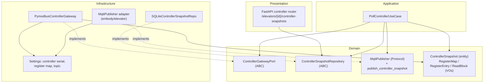
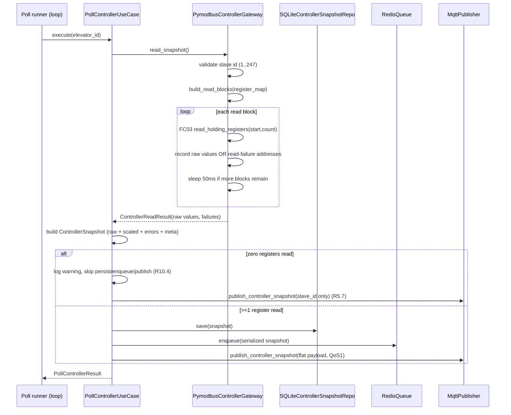

# Design Document

## Overview

This feature integrates the proven behavior of the standalone `test_modbus.py` script into the project's Clean Architecture layers. The script reads the elevator controller's full Modbus holding-register map (~80 registers across status/call, run counters, position, signals, speed/electrical, and six error-history blocks) over RS-485 using `pymodbus`, groups them into the fewest possible FC03 read requests, and publishes a flat JSON snapshot to MQTT topic `embody/elevator`.

The design adds controller telemetry as a **new, additive capability** that coexists with the three existing field-sensor reads (`ES-VS-01` vibration, `ES35-SW` temperature/humidity, `RW-ST01D` load). The existing `minimalmodbus`-based `ModbusGateway` and its `SensorReading` flow are left untouched. The new capability introduces:

- A domain port (`ControllerGatewayPort`) and a `pymodbus`-backed adapter (`PymodbusControllerGateway`).
- A new domain entity (`ControllerSnapshot`) plus value objects for the register map and read blocks.
- A new repository port (`ControllerSnapshotRepository`) and a SQLite adapter writing to a **separate** table.
- A new application use case (`PollControllerUseCase`) that orchestrates read → build snapshot → persist → enqueue → publish.
- A new flat-payload MQTT publish method on the messaging adapter targeting `embody/elevator`.
- New presentation API endpoints to expose persisted controller snapshots over REST (DB-driven, not MQTT).
- New `Settings` sections for the controller serial profile, register map, and the `embody/elevator` topic.

### Key research findings

The following findings from the existing codebase and the `test_modbus.py` reference shape the design:

1. **`pymodbus` `ModbusSerialClient` API** — The reference script calls `client.read_holding_registers(address=..., count=..., device_id=SLAVE_ID)` and checks `response.isError()` before reading `response.registers`. `ModbusException` is raised for transport-level faults. The adapter must wrap both the error-response path and the exception path. (Source: `test_modbus.py`.)
2. **Read-block grouping** — The reference `build_read_blocks` sorts by address, then opens a new block whenever the next address is not contiguous (`addr > start + count`) or the current block has reached `MAX_REGS_PER_REQUEST` (100). The requirements (R2) formalize this with explicit boundary conditions, which the design implements as a pure function for testability.
3. **Scale factor semantics** — The reference `apply_scale` parses a string like `/10` and divides; otherwise returns the raw value. Requirement 3 extends this with explicit handling for empty, non-integer, and zero divisors.
4. **Flat payload contract** — The published payload maps `str(decimal_address)` → raw 16-bit value, plus a `slave_id` integer field. This exact contract must be preserved (R5).
5. **Existing conventions** — Domain entities are frozen dataclasses (`SensorReading`); ports use `abc.ABC` (`SensorGateway`, `ReadingRepository`) or `Protocol` (`MqttPublisher`); SQLite repos convert between ORM and domain via `_to_orm`/`_to_domain`; settings use nested `pydantic` `BaseModel` groups under a `BaseSettings` root with `ELEVATOR_` env prefix and `__` nesting; the API wires repositories through `Depends`. The new code mirrors all of these.
6. **Coexistence of libraries** — `minimalmodbus` (field sensors) and `pymodbus` (controller) run against the same physical RS-485 port but as separate client objects. The controller poll path is isolated so its failures never interrupt the field-sensor poll cycle (R6).

## Architecture

The feature follows the project's inward dependency rule: `domain` defines entities/ports and imports nothing outward; `application` orchestrates via ports; `infrastructure` implements ports with `pymodbus`, SQLite, and MQTT; `presentation` exposes DB-driven REST.



### Runtime poll flow



### Layer placement of new modules

| Layer | Module | Responsibility |
| --- | --- | --- |
| domain/entities | `controller_snapshot.py` | `ControllerSnapshot`, `RegisterValue` entities |
| domain/value_objects | `register_map.py` | `RegisterEntry`, `RegisterMap`, `ReadBlock`, `ScaleFactor` |
| domain/interfaces | `controller_gateway.py` | `ControllerGatewayPort` (ABC) + `ControllerReadResult` |
| domain/interfaces | `controller_snapshot_repository.py` | `ControllerSnapshotRepository` (ABC) |
| domain/interfaces | `mqtt_publisher.py` (extend) | add `publish_controller_snapshot` |
| application/use_cases | `poll_controller.py` | `PollControllerUseCase` |
| application/services | `read_block_planner.py` | pure `build_read_blocks`, `apply_scale` helpers |
| infrastructure/sensors | `pymodbus_controller_gateway.py` | `pymodbus` adapter implementing the port |
| infrastructure/persistence | `models.py` (extend) | `ControllerSnapshot` ORM table |
| infrastructure/persistence | `sqlite_controller_snapshot_repo.py` | repository adapter |
| infrastructure/messaging | `mqtt_publisher.py` (extend) | `publish_controller_snapshot` to `embody/elevator` |
| infrastructure/config | `settings.py` (extend) | controller serial profile, register map, topic |
| presentation/api/routers | `controller.py` | REST endpoints for snapshot history |
| presentation/api/schemas | `responses.py` (extend) | `ControllerSnapshotResponse` |

## Components and Interfaces

### Domain: `ControllerGatewayPort`

An `abc.ABC` mirroring `SensorGateway`. It exposes only domain types — no `pymodbus` types leak across the boundary (R1.9, R1.10).

```python
class ControllerGatewayPort(ABC):
    @abstractmethod
    def read_snapshot(self) -> ControllerReadResult:
        """Run one controller poll cycle: validate, build blocks, FC03 reads.

        Returns a ControllerReadResult carrying successful raw register values
        keyed by address, the list of failed addresses, the slave id, and a
        status indicating connection/validation outcome. Never raises for
        per-block Modbus faults; those are reported as read failures.
        """
        ...
```

`ControllerReadResult` is a domain value object:

```python
@dataclass(frozen=True)
class ControllerReadResult:
    status: ControllerReadStatus  # OK | INVALID_SLAVE_ID | CONNECTION_UNAVAILABLE
    slave_id: int
    raw_values: dict[int, int]        # address -> raw 16-bit unsigned
    failed_addresses: tuple[int, ...] # addresses that failed to read
```

`status` distinguishes the hard-fail cases (R1.5 invalid slave id, R1.8 connection unavailable) — where no FC03 is issued and `raw_values` is empty — from a normal cycle that may still contain per-block failures (R10).

### Application: `PollControllerUseCase`

Orchestrates one poll cycle. Constructor takes the port, repository, queue, MQTT publisher, and `Settings` (mirroring `PollSensorsUseCase` wiring). It owns the scale-application and snapshot-building logic so the gateway stays focused on I/O.

```python
class PollControllerUseCase:
    def __init__(
        self,
        controller_gateway: ControllerGatewayPort,
        snapshot_repo: ControllerSnapshotRepository,
        reading_queue: ReadingQueue,
        mqtt_publisher: MqttPublisher,
        settings: Settings,
    ) -> None: ...

    def execute(self, elevator_id: str) -> PollControllerResult: ...
    def run_forever(self, elevator_id: str) -> None:  # honors Poll_Interval (R9)
        ...
```

`execute` steps:
1. Call `controller_gateway.read_snapshot()`.
2. If `status != OK`, log and return an error result without persisting/publishing (R1.5, R1.8). The field-sensor cycle is unaffected (R6.4, R6.5).
3. Build a `ControllerSnapshot` from the read result: compute scaled values via `apply_scale`, attach slave id, UTC ISO-8601 `Z` timestamp, error-history blocks, and failed-address list (R3).
4. If zero registers were read: log a warning, skip persist/enqueue, and publish a `slave_id`-only flat payload (R5.7, R10.4).
5. Otherwise: persist via repository (R4.2), enqueue serialized snapshot (R7), publish flat payload with QoS 1 (R5). Publish/enqueue failures are caught and logged without aborting the cycle (R5.6, R7.5).

### Application service: read-block planner (pure functions)

`build_read_blocks(register_map) -> list[ReadBlock]` and `apply_scale(raw, scale_factor) -> ScaledValue` are pure, side-effect-free functions placed in `application/services/read_block_planner.py`. Keeping them pure makes them the primary targets for property-based testing.

`build_read_blocks` implements R2 precisely:
- Sort entries ascending by address (R2.1).
- Extend the active block when `next_addr == max_addr_in_block + 1` and block size ≤ 99 (R2.2).
- Start a new block on an address gap (R2.3) or when the active block already holds 100 registers (R2.4).
- Guarantee no block exceeds 100 registers and no block has an internal gap (R2.5).
- Empty map → zero blocks (R2.8).

### Infrastructure: `PymodbusControllerGateway`

Implements `ControllerGatewayPort`. Constructs a `ModbusSerialClient` from `Settings.controller_serial`. Reads the register map (addresses, scale factors, display bases) from `Settings` (R8.7) — no inline literals.

Behavior:
- Validate slave id ∈ [1, 247] before any I/O; return `INVALID_SLAVE_ID` otherwise (R1.4, R1.5).
- `client.connect()`; if it fails, return `CONNECTION_UNAVAILABLE` with no FC03 issued (R1.8).
- Apply per-request timeout from `Settings` clamped to [100, 10000] ms, default 1000 ms (R1.6).
- For each block: issue `read_holding_registers(address=start, count=count, device_id=slave_id)`. On `response.isError()` or `ModbusException`, record the block's addresses as failures and continue (R10.1, R10.2). Sleep 50 ms ±5 ms between blocks when more remain (R2.6).
- Map successful registers to `raw_values[address]` (R3.2). Return a `ControllerReadResult`.

The adapter catches `pymodbus` exceptions internally so they never surface as domain/application exceptions (R1.7 reports failures via the result; R6.5 containment).

### Infrastructure: `SQLiteControllerSnapshotRepo`

Implements `ControllerSnapshotRepository`. Converts between `ControllerSnapshot` and a new ORM model `ControllerSnapshotRow` (separate table, R4.6). Raw values, scaled values, error-history blocks, and failed addresses are stored as JSON `Text` columns; slave id, elevator id, and timestamp are first-class columns for querying/indexing.

```python
class ControllerSnapshotRepository(ABC):
    @abstractmethod
    def save(self, snapshot: ControllerSnapshot) -> None: ...
    @abstractmethod
    def find_by_elevator(
        self, elevator_id: str,
        from_ts: str | None = None, to_ts: str | None = None,
        limit: int = 500,
    ) -> list[ControllerSnapshot]: ...
    @abstractmethod
    def find_latest(self, elevator_id: str) -> ControllerSnapshot | None: ...
```

`find_by_elevator` orders by timestamp descending (R4.7) and returns an empty list when none exist (R4.10). Persistence failures propagate as an error to the use case which surfaces them without writing a partial row (R4.9) — the single-row JSON-column model makes each `save` atomic.

### Infrastructure: MQTT `publish_controller_snapshot`

Adds a method to the existing `MqttPublisher` adapter that serializes the `Flat_Payload` and publishes to the `embody/elevator` topic (from `Settings`) at QoS 1, reusing the existing connection management, pending-queue, and `wait_for_publish` logic. Returns `bool`; the use case treats `False`/timeout as a logged non-fatal failure (R5.4, R5.6).

The domain `MqttPublisher` Protocol is extended:

```python
class MqttPublisher(Protocol):
    def publish_reading(self, payload: dict[str, Any]) -> bool: ...
    def publish_status(self, payload: dict[str, Any]) -> bool: ...
    def publish_controller_snapshot(self, payload: dict[str, Any]) -> bool: ...
```

### Presentation: controller router

A new `routers/controller.py` exposes DB-driven endpoints sourced from `ControllerSnapshotRepository` (R11.3), wired via a new `get_controller_snapshot_repository` dependency:

- `GET /elevators/{elevator_id}/controller-snapshots` — returns persisted snapshots, newest first (R11.1); supports `from_time`/`to_time` query filters (R11.2) and a capped `limit`.

Responses use a new `ControllerSnapshotResponse` Pydantic schema containing slave id, timestamp, raw values, scaled values, error-history blocks, and failed addresses.

### Settings additions

```python
class ControllerSerialConfig(BaseModel):
    port: str = "/dev/ttyUSB0"
    baudrate: int = 19200
    bytesize: int = 8
    parity: str = "E"
    stopbits: int = 1
    timeout_ms: int = 1000           # clamped to [100, 10000] (R1.6)

class RegisterEntryConfig(BaseModel):
    address: int
    key: str
    meaning: str = ""
    base: int = 10                   # display radix 10 or 16
    scale: str = ""                  # e.g. "/10", "/100"
    unit: str = ""

class ControllerTelemetryConfig(BaseModel):
    slave_id: int = 1                # validated 1..247 at poll time
    poll_interval_s: int = 5         # default 5s (R9.2)
    topic_elevator: str = "embody/elevator"
    register_map: list[RegisterEntryConfig] = [...]  # seeded from REGISTER_MAP
```

This is added to the `Settings` root (e.g. `controller_telemetry: ControllerTelemetryConfig`) and mirrored in `config/config.yaml`. MQTT broker/credentials continue to come from the existing `mqtt` config (R8.4, R8.6). The existing `controller` config block (used by the legacy `read_controller`) is left unchanged.

## Data Models

### Domain entities and value objects

```python
@dataclass(frozen=True)
class RegisterEntry:
    address: int          # Modbus holding-register address
    key: str              # JSON field key
    meaning: str          # human-readable description
    base: int             # display radix: 10 or 16
    scale: str            # scale factor string, e.g. "/10" ("" = raw)
    unit: str             # physical unit ("" = dimensionless)

@dataclass(frozen=True)
class RegisterMap:
    entries: tuple[RegisterEntry, ...]

@dataclass(frozen=True)
class ReadBlock:
    start: int                          # starting address
    count: int                          # number of registers (1..100)
    entries: tuple[RegisterEntry, ...]  # entries covered, contiguous

@dataclass(frozen=True)
class RegisterValue:
    address: int
    raw: int          # 0..65535
    scaled: float     # raw/divisor, or raw when no/invalid scale
    scale_invalid: bool = False  # R3.4 indicator

@dataclass(frozen=True)
class ErrorBlock:
    index: int                       # 1..6
    values: dict[int, int]           # address -> raw value for the block

@dataclass(frozen=True)
class ControllerSnapshot:
    elevator_id: str
    slave_id: int                       # 1..247
    timestamp: str                      # UTC ISO-8601, ends with "Z"
    raw_values: dict[int, int]          # address -> raw 16-bit unsigned
    scaled_values: dict[int, float]     # address -> scaled value
    error_blocks: tuple[ErrorBlock, ...]  # six error-history blocks
    failed_addresses: tuple[int, ...]   # addresses that failed to read
    id: int | None = None
```

`ControllerSnapshot` is a brand-new entity; `SensorReading` is not touched (R3.10, R4 separate table).

### Persistence schema (new table)

A new `controller_snapshots` table, separate from `sensor_readings` (R4.6):

| Column | Type | Notes |
| --- | --- | --- |
| `id` | Integer PK autoincrement | |
| `elevator_id` | String FK → elevators.id | indexed with timestamp |
| `slave_id` | Integer | 1..247 |
| `timestamp` | String | UTC ISO-8601 `Z` |
| `raw_values_json` | Text | JSON: `{address: raw}` |
| `scaled_values_json` | Text | JSON: `{address: scaled}` |
| `error_blocks_json` | Text | JSON: six error blocks |
| `failed_addresses_json` | Text | JSON: `[address, ...]` |
| `synced` | Integer | default 0 (cloud sync parity) |

Index: `idx_controller_snapshots_elevator_time (elevator_id, timestamp)`, mirroring the `sensor_readings` index. Table creation is added to `init_db` via the shared `Base.metadata.create_all`.

### Flat payload (MQTT `embody/elevator`)

```json
{
  "8211": 5,
  "8212": 1,
  "8210": 1234,
  "slave_id": 1
}
```

Keys are base-10 string representations of register addresses mapped to raw 16-bit unsigned values (R5.2); `slave_id` is an integer (R5.3). Only successfully read registers appear; a zero-register cycle yields `{"slave_id": N}` (R5.7).

### Enqueued representation (RedisQueue)

A JSON-serializable dict including raw values, scaled values, slave id, timestamp, and failed-address list (R7.2, R7.3), produced via the snapshot's serializer so a JSON round-trip preserves all fields (R7.4).

## Correctness Properties

*A property is a characteristic or behavior that should hold true across all valid executions of a system — essentially, a formal statement about what the system should do. Properties serve as the bridge between human-readable specifications and machine-verifiable correctness guarantees.*

The properties below were derived from the acceptance criteria via the prework analysis. Redundant criteria were consolidated: block-construction sub-rules (R2.2–R2.4) fold into the block-invariant property; coverage criteria (R1.3, R2.7) fold into the coverage property; scaling criteria (R3.3–R3.5) fold into one scaling property; snapshot fields (R3.1, R3.2, R3.6–R3.8) fold into the snapshot-construction property; failed-read criteria (R3.9, R10.1–R10.5) fold into the partition property; persistence storage criteria (R4.3–R4.5, R4.8) fold into the persistence round-trip; flat-payload criteria (R5.2, R5.3, R5.5) fold into the payload property; enqueue criteria (R7.1–R7.4) fold into the enqueue property; isolation criteria (R6.4, R6.5) fold into the isolation property.

### Property 1: Read-block planning covers every register exactly once

*For any* register map, the read blocks produced by `build_read_blocks` SHALL collectively cover every register address in the map exactly once, with no extra addresses.

**Validates: Requirements 1.3, 2.7**

### Property 2: Read blocks respect size and contiguity invariants

*For any* register map, every produced read block SHALL contain at most 100 registers, and within each block every pair of consecutive covered addresses SHALL differ by exactly 1 (no internal gap).

**Validates: Requirements 2.2, 2.3, 2.4, 2.5, 2.8**

### Property 3: Read blocks are globally ascending

*For any* register map, concatenating the covered addresses of the produced read blocks in block order SHALL yield a strictly ascending sequence of addresses.

**Validates: Requirements 2.1**

### Property 4: Slave id validation gates the poll cycle

*For any* integer slave id, the gateway SHALL proceed with FC03 reads when the id is in the range 1 to 247 inclusive, and SHALL return an INVALID_SLAVE_ID result issuing zero FC03 requests when the id is outside that range.

**Validates: Requirements 1.4, 1.5**

### Property 5: Per-request timeout is clamped with default

*For any* configured timeout value (including unset, below 100, or above 10000), the effective per-request read timeout SHALL be 1000 milliseconds when unset, and otherwise the value clamped to the range 100 to 10000 milliseconds inclusive.

**Validates: Requirements 1.6**

### Property 6: Scale application is correct across all scale strings

*For any* raw value in 0 to 65535 and any scale-factor string, the scaled value SHALL equal the exact decimal quotient of raw divided by the parsed base-10 divisor when the string is a non-zero base-10 integer prefixed form, and SHALL equal the raw value (with the invalid indicator set for non-integer or zero divisors, and unset for the empty string) otherwise.

**Validates: Requirements 3.3, 3.4, 3.5**

### Property 7: Snapshot construction produces a complete, well-formed snapshot

*For any* controller read result, the use case SHALL produce exactly one `ControllerSnapshot` whose slave id matches the read result, whose timestamp is a UTC ISO-8601 string ending in "Z", whose six error-history blocks are all present, and whose every raw value is an unsigned 16-bit integer in 0 to 65535.

**Validates: Requirements 3.1, 3.2, 3.6, 3.7, 3.8**

### Property 8: Successful and failed addresses form a complete disjoint partition

*For any* controller read result, the set of addresses present in the snapshot's raw/scaled values and the set of failed addresses SHALL be disjoint, and their union SHALL equal the set of addresses attempted in the poll cycle.

**Validates: Requirements 3.9, 10.1, 10.2, 10.3, 10.5**

### Property 9: Persistence round-trip preserves snapshot data

*For any* `ControllerSnapshot`, persisting it and then reading it back SHALL produce equivalent raw values, scaled values, error-history blocks, slave id, and timestamp.

**Validates: Requirements 4.3, 4.4, 4.5, 4.8**

### Property 10: Snapshot queries return newest-first

*For any* set of persisted snapshots for an elevator id, querying by that elevator id SHALL return all of them ordered from most recent timestamp to oldest.

**Validates: Requirements 4.7**

### Property 11: Flat payload mapping and JSON round-trip

*For any* `ControllerSnapshot`, the flat payload SHALL map each successfully read register's decimal-address string to its raw 16-bit value and include an integer `slave_id` field, and serializing the payload to JSON then deserializing SHALL produce equivalent address-to-raw-value entries.

**Validates: Requirements 5.2, 5.3, 5.5**

### Property 12: Enqueued representation round-trips and is enqueued once

*For any* successfully persisted `ControllerSnapshot`, exactly one serialized representation SHALL be enqueued, and serializing that representation to JSON then deserializing SHALL produce equivalent raw values, scaled values, slave id, timestamp, and failed-address entries.

**Validates: Requirements 7.1, 7.2, 7.3, 7.4**

### Property 13: Controller poll failures are contained

*For any* failure or exception arising in the controller poll path, the failure SHALL be contained within that path such that no unhandled exception propagates and the existing field-sensor poll cycle can complete its read, persist, enqueue, and publish steps.

**Validates: Requirements 6.4, 6.5**

### Property 14: Poll interval defaults when unconfigured

*For any* Settings configuration, the effective poll interval SHALL equal the configured interval when present and SHALL default to 5 seconds when not configured.

**Validates: Requirements 9.2**

## Error Handling

The design separates *hard-stop* failures (which abort the cycle before any reads) from *soft* failures (which are recorded and tolerated).

| Condition | Layer | Handling | Requirement |
| --- | --- | --- | --- |
| Slave id outside 1..247 | Gateway | Return `INVALID_SLAVE_ID`; no FC03 issued | R1.5 |
| `ModbusSerialClient.connect()` fails | Gateway | Return `CONNECTION_UNAVAILABLE`; no FC03 issued | R1.8 |
| Block `response.isError()` | Gateway | Record block addresses as failures; continue to next block | R10.1, R1.7 |
| `ModbusException` on a block | Gateway | Record block addresses as failures; continue | R10.2 |
| Zero registers read in a cycle | Use case | Log warning; skip persist/enqueue; publish `slave_id`-only flat payload | R10.4, R5.7 |
| Persistence failure | Use case | Surface error; no partial row written (single-row atomic save) | R4.9 |
| MQTT publish failure/timeout | Use case | Log; continue cycle; snapshot retained unchanged | R5.6 |
| Enqueue failure | Use case | Log; retain persisted snapshot; continue | R7.5 |
| Any exception in controller path | Use case/runner | Caught at the controller-poll boundary; never interrupts field-sensor cycle | R6.4, R6.5 |

Design choices supporting this:
- The gateway never raises for per-block Modbus faults; it reports them through `ControllerReadResult.failed_addresses`, so the application layer sees a uniform result type (no `pymodbus` exceptions cross the port — R1.9).
- `PollControllerUseCase.execute` wraps persist/enqueue/publish in independent try/except blocks so a downstream failure in one does not skip the others' logging or abort the cycle.
- The poll runner invokes the controller use case in a guarded block fully separate from `PollSensorsUseCase`, preserving the existing field-sensor flow (R6).
- Invalid scale factors do not raise; they fall back to the raw value and set `scale_invalid` (R3.4).

## Testing Strategy

This feature centers on pure transformation logic (read-block planning, scaling, snapshot construction, payload/serialization) and is well suited to property-based testing. The project uses `pytest`; properties will use the **Hypothesis** library (the standard Python PBT choice). The project does not yet declare Hypothesis as a dev dependency, so it will be added to the `[dev]` extras.

### Dual approach

- **Property tests** (Hypothesis) verify the universal properties in the Correctness Properties section across generated inputs.
- **Unit/example tests** verify specific branches, timing behavior, and adapter wiring that are not input-varying.
- **Integration tests** verify DB-backed and end-to-end paths using in-memory SQLite and mocked Modbus/MQTT clients.

### Property test configuration

- Each property test runs a minimum of **100 iterations** (Hypothesis `max_examples=100` or higher).
- Each correctness property is implemented by a **single** property-based test.
- Each test is tagged with a comment in the form:
  `# Feature: modbus-controller-telemetry, Property {number}: {property_text}`
- Generators include edge cases explicitly: empty register maps; single-entry maps; dense contiguous runs exceeding 100 registers (for P2/P1); raw values at boundaries 0 and 65535; scale strings `""`, `"/10"`, `"/100"`, `"/0"`, `"/abc"`, `"x10"`; slave ids spanning below 1, 1, 247, and above 247; snapshots with all/some/zero successful reads.

### Property-to-test mapping

| Property | Test target | Location |
| --- | --- | --- |
| P1, P2, P3 | `build_read_blocks` planner | `tests/unit/application/test_read_block_planner.py` |
| P4 | gateway slave-id validation (mocked client) | `tests/unit/infrastructure/test_pymodbus_controller_gateway.py` |
| P5 | timeout clamp helper | `tests/unit/infrastructure/test_pymodbus_controller_gateway.py` |
| P6 | `apply_scale` | `tests/unit/application/test_read_block_planner.py` |
| P7, P8 | `PollControllerUseCase` snapshot build | `tests/unit/application/test_poll_controller.py` |
| P9, P10 | `SQLiteControllerSnapshotRepo` | `tests/integration/persistence/test_controller_snapshot_repo.py` |
| P11 | flat-payload builder | `tests/unit/application/test_poll_controller.py` |
| P12 | enqueue serializer | `tests/unit/application/test_poll_controller.py` |
| P13 | controller-poll isolation | `tests/unit/application/test_poll_controller.py` |
| P14 | poll-interval default | `tests/unit/application/test_poll_controller.py` |

### Example/integration tests (non-PBT)

- **Adapter wiring (SMOKE)**: `PymodbusControllerGateway` is an instance of `ControllerGatewayPort`; domain modules import no outward/`pymodbus`/`minimalmodbus` packages (R1.1, R1.9, R1.10, R3.10, R4.1, R4.6).
- **Gateway branches (EXAMPLE)**: connection-unavailable path (R1.8); block error/exception paths produce failures (R1.7); inter-block 50 ms sleep called `n-1` times via a sleep spy (R2.6).
- **Config sourcing (SMOKE)**: serial profile, slave id, poll interval, MQTT settings, topic, and register map all read from `Settings`; source scan confirms no hardcoded credentials/addresses/ports (R8.1–R8.7).
- **Use-case branches (EXAMPLE)**: persist-within-2s (R4.2); zero-register cycle skips persist/enqueue and publishes `slave_id`-only (R10.4, R5.7); publish failure tolerated (R5.6); enqueue failure tolerated (R7.5); QoS 1 used (R5.4); repeated cycles honor interval with patched sleep (R9.1, R9.3).
- **Repository edge (EDGE_CASE)**: query with no rows returns `[]` (R4.10); persist failure writes no partial row (R4.9).
- **Regression (SMOKE)**: existing `ModbusGateway`/`SensorReading` and `embody/w`/`embody/r` tests remain green (R6.1, R6.2).
- **Integration**: combined poll cycle publishes to all three topics (R6.3); API returns persisted snapshots newest-first with time-range filtering, sourced from the repository (R11.1, R11.2, R11.3).

### Tooling

- `pytest` / `pytest-asyncio` for execution.
- `hypothesis` for property generation (added to `[dev]` extras).
- In-memory SQLite (`sqlite:///:memory:`) for repository properties and integration tests.
- Mocked `ModbusSerialClient` and `MqttPublisher` to exercise gateway/use-case logic without hardware or a broker.
- `ruff` and `mypy --strict` per project conventions.
