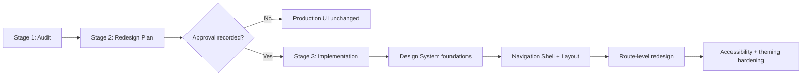
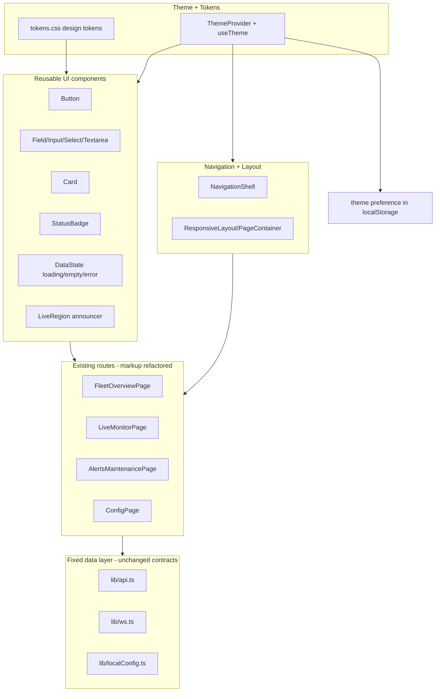
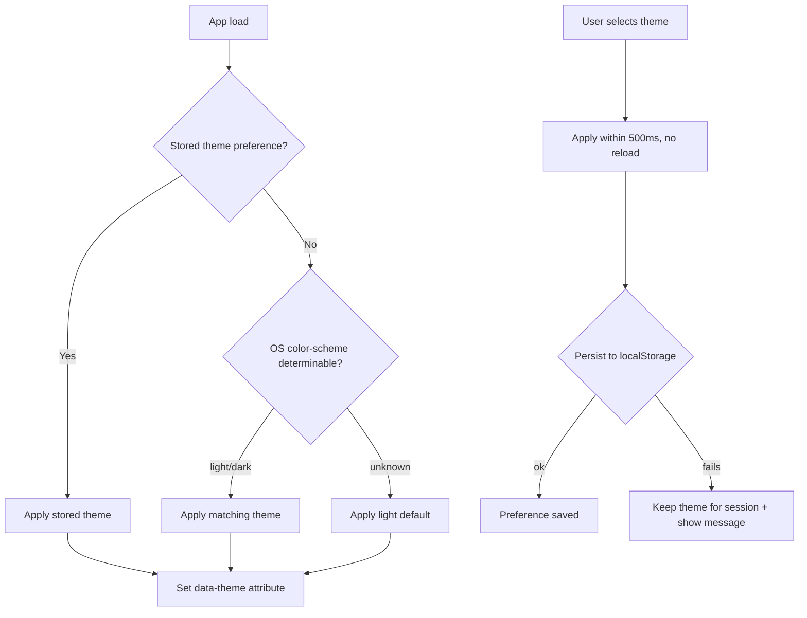

# Design Document

## Overview

This design covers a UI/UX quality and responsive-design redesign of the Elevator PDM Operations Console in `frontend/` (React 18 + TypeScript + Vite, routed with `react-router-dom` v6). The work is explicitly sequenced as **audit first, plan second, implement third**, so the design treats the Audit_Report and Redesign_Plan as first-class artifacts produced and reviewed before any production UI behavior changes. Only after the plan is approved does the design's token system, responsive layout, navigation shell, accessibility, data-state handling, and theming get implemented.

The current frontend is functional but has known quality gaps that the requirements target:

- A single hand-written global stylesheet (`frontend/src/index.css`, ~640 lines) with no design tokens — colors, spacing, radii, and font sizes are hard-coded literals scattered throughout.
- No theming: `:root` is locked to `color-scheme: light` with a fixed gradient background.
- Color-only status signaling in `.status-badge--healthy/--warning/--critical` and connection state text.
- A non-collapsible sidebar (`.app-shell` collapses to stacked layout below 960px but the nav never collapses behind a control).
- Limited accessibility: no skip link, focus styles rely on browser defaults, charts expose only a generic `aria-label`, no live regions for loading/error states, touch targets not guaranteed to be 44px.
- Internal endpoint URLs (`apiBaseUrl`, socket URL, `/elevators` paths) are surfaced on Fleet, Live Monitor, and Alerts routes, not just Local Config.

### Scope and Constraints

- Scope is limited to the presentation layer in `frontend/`. The REST history contract (`frontend/src/lib/api.ts`) and live WebSocket telemetry contract (`frontend/src/lib/ws.ts`) are fixed inputs. No backend API shapes change.
- The four existing routes are preserved: Fleet Overview (`/fleet`), Live Monitor (`/live`), Alerts & Maintenance (`/alerts`), Local Config (`/config`).
- The redesign must not regress existing behavior until the Redesign_Plan records an approval decision (Requirement 2.5).
- Charts currently use a hand-rolled SVG sparkline (`MetricSparkline.tsx`); the redesign keeps this dependency-free SVG approach to avoid adding charting libraries, but makes it accessible.

### Goals

1. Produce a traceable Audit_Report and an approved, dependency-ordered Redesign_Plan.
2. Introduce a token-based Design_System with light/dark theming.
3. Make all four routes responsive across Mobile, Tablet, Desktop, and Large_Desktop breakpoints with no horizontal scrolling at >= 320px.
4. Provide a responsive Navigation_Shell that collapses on small viewports.
5. Reach WCAG 2.1 AA conformance for contrast, focus, keyboard operability, non-color status signaling, touch targets, live-region announcements, and reduced motion.
6. Provide consistent loading, empty, error, and live-data feedback across views.

## Architecture

### Sequenced Delivery Model

The feature is delivered in three ordered stages that mirror the requirements:



- **Stage 1 (Audit)**: A documented `audit.md` artifact enumerating issues with stable IDs, location, severity, category, and WCAG references for accessibility issues, plus a coverage list of examined files/routes.
- **Stage 2 (Plan)**: A documented `redesign-plan.md` artifact listing target components, their replaced source, dependency-ordered steps, issue mappings, and an approval record. While no approval is recorded, no production UI code changes.
- **Stage 3 (Implementation)**: Token foundations first, then the navigation/layout shell, then each route, then accessibility/theming hardening.

Both `audit.md` and `redesign-plan.md` live alongside this design in `.kiro/specs/ui-ux-responsive-redesign/`.

### Target Frontend Module Architecture

The implementation layers the presentation cleanly without changing the data libraries:



Key architectural decisions:

- **Tokens as CSS custom properties**: Design tokens are defined as CSS variables on `:root` and overridden under a `[data-theme="dark"]` selector. This keeps theme switching to a single attribute toggle with no full reload (Requirement 8.5) and lets the existing CSS class approach reference `var(--token)` instead of literals. No CSS-in-JS library is added, keeping the dependency surface minimal (current deps are only react, react-dom, react-router-dom).
- **ThemeProvider via React context**: A `ThemeProvider` resolves the initial theme (stored preference -> OS `prefers-color-scheme` -> light default), applies `data-theme` to `document.documentElement`, persists changes to `localStorage`, and exposes `useTheme()`. It mirrors the existing `useSyncExternalStore` pattern already used in `localConfig.ts`.
- **Breakpoint detection**: A `useBreakpoint()` hook wraps `matchMedia` to report the active Breakpoint (Mobile/Tablet/Desktop/Large_Desktop). The Navigation_Shell and Responsive_Layout consume it. CSS media queries handle the bulk of layout; the hook handles behavior that must branch in JS (nav collapse mode, single-column chart arrangement).
- **Live-region announcer**: A single app-level `LiveRegion` component renders an `aria-live="polite"` and an `aria-live="assertive"` node. A `useAnnouncer()` hook lets any view push loading (polite) and error (assertive) messages, satisfying Requirement 6.6/6.7 without each view managing its own live region.
- **Data layer untouched**: `lib/api.ts`, `lib/ws.ts`, and `lib/localConfig.ts` keep their contracts. The redesign only changes how components render states derived from them. Endpoint URL strings are removed from non-Config routes (Requirement 7.8).

### Theme Resolution Flow



### Responsive Breakpoint System

| Breakpoint | Viewport width | Primary columns | Nav mode |
|---|---|---|---|
| Mobile | < 640px | 1 | Collapsed behind menu control |
| Tablet | 640px – 1023px | <= 2 | Collapsed behind menu control |
| Desktop | 1024px – 1439px | multi | Persistent sidebar |
| Large_Desktop | >= 1440px | multi, content capped at 1440px centered | Persistent sidebar |
| Below 320px | < 320px | 1, horizontal scroll permitted | Collapsed behind menu control |

## Components and Interfaces

### Design Tokens (`frontend/src/styles/tokens.css`)

Single source of truth for all visual values, defined as CSS custom properties. Each category has named entries; each token resolves to one value per theme.

- **Color**: `--color-bg`, `--color-surface`, `--color-text`, `--color-text-muted`, `--color-border`, `--color-accent`, plus status colors `--color-status-healthy`, `--color-status-warning`, `--color-status-critical`, `--color-status-unknown` (and `-on` text-on-status variants). Overridden under `[data-theme="dark"]`.
- **Typography**: font family token plus a scale of at least five steps `--font-size-xs/sm/md/lg/xl/2xl`.
- **Spacing**: a scale of at least six steps `--space-1` … `--space-8`.
- **Border-radius**: `--radius-sm/md/lg/pill`.
- **Elevation**: `--elevation-1/2/3` (box-shadow tokens).
- **Motion**: `--motion-fast`, `--motion-base`, `--motion-emphasis` (durations) and easing tokens; all wrapped so they collapse to `0ms`/none under `prefers-reduced-motion`.

### Theme System (`frontend/src/theme/`)

`ThemeProvider.tsx`:

```typescript
type ThemeName = "light" | "dark";

interface ThemeContextValue {
  theme: ThemeName;          // currently applied theme
  source: "stored" | "system" | "default";
  setTheme: (next: ThemeName) => void;  // applies + persists
  toggleTheme: () => void;
  persistenceFailed: boolean; // true if last save to localStorage failed
}

function resolveInitialTheme(): { theme: ThemeName; source: ThemeContextValue["source"] };
function useTheme(): ThemeContextValue;
```

- Applies `data-theme` to `document.documentElement`.
- `setTheme` writes to `localStorage` key `elevator-pdm.theme`; on failure (e.g. quota/security error) sets `persistenceFailed` so the UI can show a non-blocking message while keeping the theme for the session (Requirement 8.7).
- A `ThemeToggle` control lives in the Navigation_Shell.

### Breakpoint Hook (`frontend/src/hooks/useBreakpoint.ts`)

```typescript
type Breakpoint = "mobile" | "tablet" | "desktop" | "large";

function useBreakpoint(): {
  breakpoint: Breakpoint;
  isNavCollapsible: boolean; // true for mobile/tablet
};
```

Implemented with `window.matchMedia` listeners for the 640 / 1024 / 1440 thresholds.

### Live-Region Announcer (`frontend/src/a11y/`)

```typescript
interface Announcer {
  announcePolite: (message: string) => void;   // loading state
  announceAssertive: (message: string) => void; // error state
}

function useAnnouncer(): Announcer;
```

A `LiveRegionProvider` renders persistent `aria-live` nodes near the root. Views call `announcePolite`/`announceAssertive` when Data_State transitions to loading/error within the 1-second budget (Requirements 6.6, 6.7).

### Reusable UI Components (`frontend/src/components/ui/`)

Satisfies Requirement 3.8.

- **`Button`** — variants (primary/secondary/ghost), min 44x44px hit area, token-driven, visible focus ring. Replaces `.button-link`, `.action-button*` literals.
- **`Field`** + **`TextInput` / `Select` / `Textarea`** — label association, `aria-describedby` wiring to validation messages exposing full text (Requirement 6.8), 44px targets.
- **`Card`** — token-driven surface/elevation. Replaces `.card`, `.fleet-card`, `.summary-card`, `.panel`, `.workflow-card` literal styling.
- **`StatusBadge`** — maps a status state to a visual treatment that combines color **and** a non-color attribute (icon glyph + text label + shape), satisfying Requirements 3.6, 3.7, 6.3.
- **`DataState`** — renders loading (spinner + polite announce), empty (named missing data), and error (view name + reason + retry control) presentations, satisfying Requirement 7.

### StatusBadge State Mapping

```typescript
type StatusState = "healthy" | "warning" | "critical" | "unknown";

interface StatusVisual {
  color: string;     // token reference
  icon: string;      // distinct glyph per state (non-color signal)
  label: string;     // text label (non-color signal)
  shape: "pill" | "diamond" | "triangle" | "square"; // distinct outline per state
}
```

Each of the four states differs from the other three by icon, label, and shape in addition to color (Requirement 3.7). A shared mapper translates domain values (elevator `status`, alert `severity`, maintenance `status`, connection state) into a `StatusState`.

### Navigation Shell (`frontend/src/components/layout/NavigationShell.tsx`)

Replaces the current `AppShell.tsx`.

```typescript
interface NavigationShellState {
  isExpanded: boolean;   // small-viewport menu open/closed
}
```

Behavior:

- Desktop/Large_Desktop: persistent sidebar (Requirement 5.1).
- Mobile/Tablet: nav collapsed behind a single menu control (Requirement 5.2). Activating it toggles expand/collapse (Requirements 5.3, 5.4). Selecting a link navigates and collapses (Requirement 5.5).
- Transitioning up to Desktop/Large while expanded shows the persistent sidebar (Requirement 5.6).
- Active link gets a treatment distinct from non-active links via a non-color means (e.g. left rail indicator + `aria-current="page"` + weight) in addition to color (Requirement 5.7).
- Includes a skip-to-content link and the `ThemeToggle`.
- Endpoint URL/status code currently shown in the sidebar brand block is removed (moved to Config only, Requirement 7.8).

### Responsive Layout (`frontend/src/components/layout/PageContainer.tsx`)

- Mobile: single-column primary content (Requirement 4.1).
- Tablet: multi-card content in at most two columns (Requirement 4.2).
- Large_Desktop: primary content region capped at 1440px and centered (Requirement 4.3).
- No horizontal page scroll at >= 320px (Requirement 4.4); below 320px, single column with horizontal scroll permitted (Requirement 4.8).
- Layout arrangement changes only at defined Breakpoint thresholds (Requirement 4.6), reflow completes within 500ms (Requirement 4.7).

### Live Monitor View Specifics

- Charts arranged in a single column at Mobile (Requirement 4.5).
- `MetricSparkline` gains an accessible text alternative including latest value, unit, and timestamp of the latest value (Requirement 6.9), replacing the generic `aria-label`.
- A persistent text label marks the interpolated synthetic trace distinctly from live packet data (Requirement 7.6) — the existing `source: "actual" | "synthetic"` distinction already exists in `LiveMonitorPage`.
- The connection Status_Indicator maps WebSocket state to exactly three mutually distinct visual treatments for connected / connecting / disconnected, updated within 1 second (Requirement 7.7). The current code already tracks `connectionState`; this design normalizes it to the three canonical states.

### Data-State Handling (all routes)

- Loading indicator shown within 300ms of request start (Requirement 7.1).
- Loading > 30s triggers timeout error with retry (Requirement 7.2) via an `AbortController` + timer.
- Empty state names the missing data (Requirement 7.3).
- Error state names the view, states reason, presents retry, and preserves previously loaded data (Requirement 7.4) — error is held in separate state from data, matching the existing pattern where `setError` does not clear `elevators`.
- Retry re-requests and returns to loading (Requirement 7.5).

### Interface Inventory (Audit & Plan artifacts)

`audit.md` issue record shape:

```typescript
interface AuditIssue {
  id: string;            // stable unique, e.g. "A-001"
  location: string;      // file path OR route name
  severity: "critical" | "major" | "minor";
  category: "visual-design" | "layout-responsiveness"
          | "navigation-ia" | "accessibility" | "data-state-feedback";
  wcagCriterion?: string; // required when category === "accessibility"
  description: string;
  recommendation: string;
}

interface AuditCoverageEntry {
  location: string;      // examined file path or route
  issueCount: number;    // 0 recorded explicitly when none found
}
```

`redesign-plan.md` step record shape:

```typescript
interface PlanComponent {
  componentId: string;          // unique
  replaces: string | "net-new"; // file path / component name, or net-new
}

interface PlanStep {
  stepId: string;
  description: string;
  mappedIssueIds: string[];     // from AuditIssue.id
  justification?: string;       // required when mappedIssueIds is empty
  dependsOn: string[];          // enforces foundations-before-routes ordering
}

interface PlanApproval {
  reviewer: string;
  approvedDate: string; // ISO date
}
```

## Data Models

The redesign introduces no backend data models. All API and WebSocket payload shapes remain exactly as defined in `frontend/src/lib/api.ts` (`ElevatorSummary`, `SensorReading`, `AlertRecord`, `MaintenanceRecord`, payload types) and `frontend/src/lib/ws.ts`. The only new persistent state is the theme preference.

### Theme Preference (client-side, localStorage)

```typescript
// localStorage key: "elevator-pdm.theme"
type StoredThemePreference = "light" | "dark"; // absent => no stored preference
```

### Status State Model (presentation-only)

```typescript
type StatusState = "healthy" | "warning" | "critical" | "unknown";
```

Domain-to-status mapping (presentation logic, derived from existing fields, no contract change):

| Source | Source values | StatusState |
|---|---|---|
| Elevator `status` | `CRITICAL`, `OVERLOAD` | critical |
| Elevator `status` | `WARNING` | warning |
| Elevator `latest_health_score` | >= 80 | healthy |
| Elevator `latest_health_score` | 50–79 | warning |
| Elevator `latest_health_score` | < 50 | critical |
| Elevator `status`/score | null / indeterminate | unknown |
| Alert `severity` | `EMERGENCY`, `CRITICAL` | critical/warning |
| Maintenance `status` | `completed`/`scheduled`/`cancelled`/`pending` | healthy/warning/critical/unknown |
| WS connection | connected / connecting / disconnected | distinct three-state indicator |

### Data_State Model (presentation-only)

```typescript
type DataState = "loading" | "empty" | "error" | "populated";

interface ViewDataState<T> {
  state: DataState;
  data: T | null;      // preserved across error transitions
  error: string | null;
  lastUpdatedAt: string | null;
}
```

## Correctness Properties

*A property is a characteristic or behavior that should hold true across all valid executions of a system — essentially, a formal statement about what the system should do. Properties serve as the bridge between human-readable specifications and machine-verifiable correctness guarantees.*

This feature is predominantly UI rendering, layout, and theming, where snapshot/example/integration tests are the right tool. However, several embedded pieces are pure functions with meaningful input variation — theme resolution precedence, breakpoint classification, contrast-ratio computation over the token palette, the status-state mapping, the navigation toggle reducer, chart alt-text generation, and the data-state reducer. The properties below target exactly those pure-logic surfaces. The Audit_Report and Redesign_Plan acceptance criteria (Requirements 1 and 2) describe written deliverables verified by review, and the timing/visual/keyboard criteria are covered by integration and example tests in the Testing Strategy.

### Property 1: Token resolution yields exactly one value per theme

*For all* defined design tokens and *for all* active themes, resolving the token returns exactly one defined value (never undefined and never ambiguous).

**Validates: Requirements 3.2**

### Property 2: Status indicators are distinct by a non-color attribute

*For all* ordered pairs of distinct status states drawn from {healthy, warning, critical, unknown}, their visual treatments differ in at least one non-color attribute (icon, shape, or text label), and *for all* status states the treatment includes at least one non-color signal (a text label or icon) in addition to color.

**Validates: Requirements 3.6, 3.7, 6.3**

### Property 3: Breakpoint classification is correct and stable within bands

*For all* viewport widths, the layout classifier assigns exactly one Breakpoint and a layout descriptor such that: widths below 640px yield a single column (and charts single column) with a collapsible nav; widths 640–1023px yield at most two columns with a collapsible nav; widths 1024–1439px yield a persistent sidebar; widths >= 1440px yield a persistent sidebar with content width capped at 1440px and centered; widths below 320px yield a single column with horizontal scroll permitted. Furthermore, *for all* pairs of widths within the same Breakpoint band the classification is identical, so arrangement changes only when a defined threshold is crossed.

**Validates: Requirements 4.1, 4.2, 4.3, 4.5, 4.6, 4.8, 5.1, 5.2**

### Property 4: Navigation toggle is an involution and link selection collapses

*For all* navigation states, applying the menu toggle once flips the expanded/collapsed state and applying it twice returns to the original state; and *for all* navigation states while in collapsible mode, performing a link-selection action results in the navigation being collapsed.

**Validates: Requirements 5.3, 5.4, 5.5**

### Property 5: Active navigation link is distinguished by a non-color means

*For all* active routes, the rendered active navigation link is marked with `aria-current="page"` and a non-color distinction (indicator and/or font weight) that differs from every non-active link, in addition to any color difference.

**Validates: Requirements 5.7**

### Property 6: Palette contrast meets WCAG AA in every theme

*For all* active themes and *for all* defined foreground/background token pairings used together (normal text, large text, status graphical elements, and focus-indicator-versus-adjacent pairings), the computed contrast ratio is at least the applicable threshold: 4.5:1 for normal-size text and at least 3:1 for large-size text, status graphical elements, and focus indicators.

**Validates: Requirements 6.1, 6.2, 6.4, 8.8**

### Property 7: Interactive controls meet the minimum touch-target size

*For all* interactive UI component variants (buttons, inputs, selects, textareas, the menu control, and nav links), the rendered control exposes a hit area of at least 44px by 44px.

**Validates: Requirements 6.5**

### Property 8: Validation messages are accessibly linked with full text

*For all* validation message strings associated with a form input, the rendered input references the message via an accessible description (`aria-describedby`) whose referenced element exposes the complete message text.

**Validates: Requirements 6.8**

### Property 9: Chart text alternative includes latest value, unit, and timestamp

*For all* non-empty telemetry series with a unit and timestamps, the chart's accessible text alternative contains the latest value, the metric unit, and the timestamp of the latest value.

**Validates: Requirements 6.9**

### Property 10: Empty state names the missing data

*For all* view labels, the rendered empty Data_State message contains the name of the missing data for that view.

**Validates: Requirements 7.3**

### Property 11: Error state preserves prior data and describes the failure

*For all* previously loaded data, view names, and failure reasons, transitioning a view's Data_State to error preserves the previously loaded data unchanged, exposes a retry control, and produces a message containing both the affected view name and the failure reason.

**Validates: Requirements 7.4**

### Property 12: Synthetic telemetry is always labeled when present

*For all* display point sets that contain at least one interpolated (synthetic) point, the Live_Telemetry_View renders a persistent label distinguishing synthetic data from live packet data.

**Validates: Requirements 7.6**

### Property 13: Connection states map to three mutually distinct treatments

*For all* three connection states (connected, connecting, disconnected), the connection Status_Indicator produces three pairwise-distinct visual treatments.

**Validates: Requirements 7.7**

### Property 14: Endpoint URLs are confined to the Local Config route

*For all* renders of any non-Config route with arbitrary data, the rendered output contains no internal endpoint URL (REST base URL or WebSocket URL).

**Validates: Requirements 7.8**

### Property 15: Theme resolution follows stored-then-system-then-default precedence

*For all* combinations of stored preference (none, light, dark) and operating-system color-scheme (light, dark, indeterminate), the resolved theme is: the stored preference when one exists; otherwise the operating-system color-scheme when it is light or dark; otherwise the light theme.

**Validates: Requirements 8.2, 8.3, 8.4**

### Property 16: Theme persistence round-trips

*For all* selectable themes, persisting the theme and then resolving the initial theme (with persistence succeeding and the operating-system scheme held fixed) returns the same theme that was persisted.

**Validates: Requirements 8.6**

## Error Handling

### Data request failures (REST)

- Each view holds `data` and `error` in separate state. On request failure the view transitions Data_State to `error`, sets a message containing the view name and the failure reason, and renders a retry control while leaving previously loaded `data` intact (Requirement 7.4). This matches the existing pattern where `setError(...)` does not clear loaded collections.
- Aborted requests (component unmount, elevator switch, refresh-interval cancellation) are ignored via `AbortController` and `signal.aborted` guards, as already done in the current pages, so a cancellation never surfaces as an error.
- A loading watchdog timer fires at 30s; on expiry the in-flight request is aborted and the view shows a timeout error with a retry control (Requirement 7.2).
- Activating retry re-issues the request and returns the view to the `loading` Data_State (Requirement 7.5).

### Live WebSocket failures

- The Live Monitor normalizes socket lifecycle into exactly three connection states (connected, connecting, disconnected); `onerror`/`onclose` resolve to `disconnected`, `onopen` to `connected`, and pre-open to `connecting`. The connection Status_Indicator reflects the change within 1s (Requirement 7.7).
- Malformed or partial WebSocket messages (missing `timestamp` or `readings`) are skipped without throwing, preserving the existing guard in `LiveMonitorPage`.
- When live packets stop arriving, the synthetic-trace path engages and is always accompanied by a persistent "interpolated" label (Requirement 7.6).

### Theme persistence failure

- If writing the theme preference to `localStorage` throws (private-mode/quota/security), the selected theme remains applied for the current session and a non-blocking message indicates the preference could not be saved (Requirement 8.7). The applied theme is never reverted on a persistence error.

### Accessibility-related error surfacing

- Error Data_State changes are announced through an assertive live region within 1s, including a text description (Requirement 6.6). Loading changes are announced politely (Requirement 6.7). Form validation messages are linked to inputs via `aria-describedby` exposing full text (Requirement 6.8).

### Audit/Plan gating

- While the Redesign_Plan records no approval decision, the implementation must not change production UI behavior (Requirement 2.5). This is enforced procedurally: token/component/route changes are gated behind the recorded approval in `redesign-plan.md`.

## Testing Strategy

### Tooling

- **Unit + property tests**: Vitest as the test runner (Vite-native) with `@testing-library/react` and `jsdom` for component rendering, and **fast-check** for property-based tests. These devDependencies are added to `frontend/package.json` (currently only React/Vite are present). fast-check is the established PBT library for the TypeScript/JS ecosystem and must not be reimplemented.
- **Integration/visual**: `@testing-library/react` interaction tests with fake timers for timing criteria, and `jest-axe` (or equivalent) automated accessibility assertions per route.
- **Static checks**: an ESLint/stylelint rule (or a targeted test) that flags hard-coded color/size literals in component styles to enforce token usage (Requirement 3.3), and a token-category presence check (Requirements 3.1, 3.4, 3.5).

### Property-based tests

- Each correctness property in this document is implemented by a **single** property-based test.
- Each property test runs a **minimum of 100 iterations**.
- Each property test is tagged with a comment referencing the design property, using the format:
  `// Feature: ui-ux-responsive-redesign, Property {number}: {property_text}`
- Generators:
  - **Widths** (Properties 3): integers spanning sub-320 through > 1440, with extra weight at the 320/640/1024/1440 boundaries and ±1 around each threshold.
  - **Status states / connection states** (Properties 2, 13): enumerated sets.
  - **Color pairs** (Property 6): the actual defined token pairings per theme (enumerated from the token map), not random colors, since the claim is about the chosen palette; contrast computed via the WCAG relative-luminance formula.
  - **Strings** (Properties 8, 9, 10, 11): arbitrary unicode strings for messages, view labels, units, and reasons, including empty and whitespace.
  - **Telemetry series** (Property 9, 12): arrays of numeric points with timestamps and a source flag.
  - **Theme/OS combinations** (Properties 15, 16): full cross-product of {none,light,dark} × {light,dark,indeterminate}.
  - **Nav states** (Property 4): boolean expanded state plus mode flag.

### Unit and example tests (non-property criteria)

- **Audit_Report (Req 1) and Redesign_Plan (Req 2)**: verified by structured review of `audit.md` and `redesign-plan.md` against the field checklists in the Interface Inventory; an optional lightweight parser test asserts every issue has a unique id, a valid severity/category, a WCAG reference when category is accessibility, and that every examined location appears in the coverage list (including zero-issue entries). Plan ordering (foundations precede routes) and critical-issue coverage are asserted against the parsed step list.
- **Token foundations (3.1, 3.4, 3.5, 3.8)**: example assertions on token-category presence, scale lengths, and exported component set.
- **Live regions (6.6, 6.7)**: example tests with fake timers asserting assertive/polite region content within the time budget.
- **Reduced motion (6.10)**: example test with `prefers-reduced-motion` matched, asserting non-essential animations are disabled.
- **Keyboard operability and focus trap (6.11, 6.12)**: per-route integration traversal asserting every interactive element is reachable and focus is never trapped.
- **Loading/timeout/retry timing (7.1, 7.2, 7.5)**: fake-timer tests on the fetch state machine (indicator < 300ms, timeout at 30s, retry returns to loading).
- **No horizontal scroll and reflow timing (4.4, 4.7)**: integration tests at representative widths (320, 375, 768, 1024, 1440) asserting `scrollWidth <= clientWidth` and that breakpoint-crossing reflow completes within 500ms.
- **Theme application and persistence (8.1, 8.5, 8.7)**: example tests asserting both themes exist, that selecting a theme updates `data-theme` without a reload, and that a throwing `localStorage.setItem` keeps the session theme and sets `persistenceFailed`.
- **Transition to desktop while expanded (5.6)**: example test resizing from mobile-expanded to desktop and asserting the persistent sidebar.

### Coverage balance

Property tests own universal correctness (classification, precedence, contrast, distinctness, round-trips, invariants). Unit/example/integration tests own concrete scenarios, timing, real-DOM layout, document deliverables, and keyboard/screen-reader behavior. Together they cover the testable acceptance criteria; criteria describing written deliverables or subjective visual quality are validated by review rather than automated tests.
