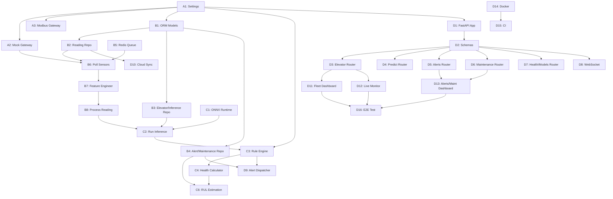

# Phase 1 — Engineering Tasks

> Derived from [implementation_plan.md](file:///d:/OneDrive%20-%20DATGROUP/Documents/elevator/docs/implementation_plan.md)
> Each task: affects limited files, is independently testable, includes acceptance criteria.

---

## Phase 1A — Hardware & Connectivity (Week 1–2)

### TASK-A1: Pydantic Settings & Config Loader

| | |
|---|---|
| **Files** | `infrastructure/config/settings.py`, `config/config.yaml`, `config/logging.yaml` |
| **Description** | Create `Settings` class (Pydantic BaseSettings) that loads from `config.yaml` + env vars. Include serial port, sensor slave IDs, poll intervals, thresholds, model paths, alert config. |
| **Acceptance Criteria** | ① `Settings()` loads all fields from `config.yaml` ② Env vars override YAML values ③ `pytest` test validates defaults, overrides, and missing-field errors |

### TASK-A2: Mock Sensor Gateway

| | |
|---|---|
| **Files** | `infrastructure/sensors/mock_gateway.py`, `tests/unit/infrastructure/test_mock_gateway.py` |
| **Description** | Implement `SensorGateway` interface with realistic random data within physical ranges. Configurable via seed for reproducibility. |
| **Acceptance Criteria** | ① Returns valid `dict` for each `read_vibration()`, `read_temp_humidity()`, `read_load()` ② Values stay within spec ranges (accel 0–500mg, temp -10–100°C, load 0–2000kg) ③ Unit test passes with fixed seed |

### TASK-A3: Modbus Sensor Gateway

| | |
|---|---|
| **Files** | `infrastructure/sensors/modbus_gateway.py`, `tests/unit/infrastructure/test_modbus_gateway.py` |
| **Description** | Implement `SensorGateway` using `minimalmodbus` + `pyserial`. Read vibration (slave 1), temp/humidity (slave 2), load (slave 3). Configurable register addresses from `Settings`. |
| **Acceptance Criteria** | ① Reads all 3 sensors when connected to RS-485 bus ② Raises `SensorUnavailableError` on Modbus timeout ③ Unit test mocks `minimalmodbus.Instrument` and validates register calls |

---

## Phase 1B — Data Pipeline (Week 2–4)

### TASK-B1: SQLAlchemy ORM Models & Database Init

| | |
|---|---|
| **Files** | `infrastructure/persistence/models.py`, `infrastructure/persistence/database.py` |
| **Description** | Define ORM models for all 5 tables (elevators, sensor_readings, inference_results, alerts, maintenance_schedule) per Section 4. Create engine/session factory with `create_all()`. |
| **Acceptance Criteria** | ① `create_all()` creates all 5 tables in in-memory SQLite ② Indexes exist on `(elevator_id, timestamp)` for sensor_readings and inference_results ③ FK constraints enforced ④ `pytest` inserts and queries sample rows successfully |

### TASK-B2: SQLite Reading Repository

| | |
|---|---|
| **Files** | `infrastructure/persistence/sqlite_reading_repo.py`, `tests/unit/infrastructure/test_sqlite_reading_repo.py` |
| **Description** | Implement `ReadingRepository` interface: `save()`, `find_by_elevator()` (with time range + sensor filter + limit), `find_latest()`, `find_unsynced()`, `mark_synced()`. |
| **Acceptance Criteria** | ① `save()` persists a `SensorReading` and auto-increments ID ② `find_by_elevator()` filters by time range and sensor_id correctly ③ `find_unsynced()` returns only rows with `synced=0` ④ `mark_synced()` sets `synced=1` ⑤ All tested against in-memory SQLite |

### TASK-B3: Elevator & Inference Repositories

| | |
|---|---|
| **Files** | `infrastructure/persistence/sqlite_elevator_repo.py`, `infrastructure/persistence/sqlite_inference_repo.py`, `domain/interfaces/elevator_repository.py`, `domain/interfaces/inference_repository.py` |
| **Description** | Implement repository interfaces and SQLite adapters for elevators (CRUD) and inference_results (save, query by elevator, query by status). |
| **Acceptance Criteria** | ① Create/read/update elevator records ② Save and query inference results by elevator_id and time range ③ Filter by status (NORMAL/WARNING/CRITICAL) works ④ Unit tests pass on in-memory SQLite |

### TASK-B4: Alert & Maintenance Repositories

| | |
|---|---|
| **Files** | `infrastructure/persistence/sqlite_alert_repo.py`, `infrastructure/persistence/sqlite_maintenance_repo.py`, `domain/interfaces/alert_repository.py`, `domain/interfaces/maintenance_repository.py` |
| **Description** | Implement repository interfaces and SQLite adapters for alerts (save, query, acknowledge) and maintenance_schedule (CRUD, filter by status/urgency). |
| **Acceptance Criteria** | ① Save alert and query by elevator_id, severity, acknowledged status ② `acknowledge()` sets acknowledged=1 with technician and timestamp ③ Maintenance CRUD with status transitions (pending→scheduled→completed) ④ Unit tests pass |

### TASK-B5: Redis Queue Adapter

| | |
|---|---|
| **Files** | `infrastructure/messaging/redis_queue.py`, `infrastructure/messaging/redis_event_bus.py`, `tests/unit/infrastructure/test_redis_queue.py` |
| **Description** | Implement queue (LPUSH/BRPOP) for sensor readings and event bus (pub/sub) for domain events. Include `EventBus` interface implementation. |
| **Acceptance Criteria** | ① `enqueue(reading)` serializes to JSON and pushes to Redis list ② `dequeue()` blocks and returns deserialized reading ③ `publish(event)` / `subscribe(handler)` delivers domain events ④ Tests use `fakeredis` |

### TASK-B6: Poll Sensors Use Case

| | |
|---|---|
| **Files** | `application/use_cases/poll_sensors.py`, `tests/unit/application/test_poll_sensors.py` |
| **Description** | Orchestrate: call `SensorGateway` → build `SensorReading` entity → save via `ReadingRepository` → enqueue to Redis. Per-sensor error handling with exponential backoff. |
| **Acceptance Criteria** | ① Calls all 3 sensor read methods ② Persists readings to repository ③ Enqueues readings to Redis ④ Single sensor failure doesn't block others ⑤ Backoff doubles on consecutive errors (max 60s) ⑥ Unit test with mock gateway + repo |

### TASK-B7: Feature Engineer Service

| | |
|---|---|
| **Files** | `application/services/feature_engineer.py`, `tests/unit/application/test_feature_engineer.py` |
| **Description** | Compute all 11 rolling features from Section 3.3: accel_rms_mean/std, accel_delta, accel_roc, velocity_rms_z, peak_to_rms_ratio, motor_temp_delta, humidity_trend, load_pct, load_variance, multivariate_score. Maintain internal ring buffer. |
| **Acceptance Criteria** | ① Given 120 readings (10min × 5s interval), computes correct rolling mean/std ② Z-score returns 0.0 for mean-valued input ③ `load_pct` = load_kg / max_capacity exactly ④ Returns complete feature dict with no NaN ⑤ Unit test with synthetic data |

### TASK-B8: Process Reading Use Case

| | |
|---|---|
| **Files** | `application/use_cases/process_reading.py`, `tests/unit/application/test_process_reading.py` |
| **Description** | Orchestrate: dequeue reading from Redis → pass to `FeatureEngineer` → return feature vector for inference. |
| **Acceptance Criteria** | ① Dequeues from Redis ② Passes reading to feature engineer ③ Returns feature dict ready for model input ④ Handles empty queue gracefully (blocks/returns None) ⑤ Unit test with mock queue |

---

## Phase 1C — ML Models (Week 4–8)

### TASK-C1: ONNX Model Runtime Adapter

| | |
|---|---|
| **Files** | `infrastructure/ml/onnx_runtime.py`, `infrastructure/ml/model_registry.py`, `tests/unit/infrastructure/test_onnx_runtime.py` |
| **Description** | Implement `ModelRuntime` interface using `onnxruntime.InferenceSession`. `ModelRegistry` tracks versions and supports hot-reload. |
| **Acceptance Criteria** | ① Loads `.onnx` file and runs `predict(features)` → `InferenceResult` ② `reload()` swaps model without restart ③ `model_version` returns version string ④ Raises `ModelNotLoadedError` if file missing ⑤ Test with a tiny dummy ONNX model |

### TASK-C2: Run Inference Use Case

| | |
|---|---|
| **Files** | `application/use_cases/run_inference.py`, `tests/unit/application/test_run_inference.py` |
| **Description** | Accept feature vector → call `ModelRuntime.predict()` → save `InferenceResult` to repository → publish `AnomalyDetected` event if WARNING/CRITICAL. |
| **Acceptance Criteria** | ① Calls model runtime with correct feature dict ② Persists result to inference repository ③ Publishes domain event only for non-NORMAL status ④ Returns `InferenceResult` to caller ⑤ Unit test with mock runtime |

### TASK-C3: Rule-Based Overload Detection

| | |
|---|---|
| **Files** | `application/use_cases/evaluate_rules.py`, `tests/unit/application/test_evaluate_rules.py` |
| **Description** | Apply threshold rules from `config.yaml`: accel_rms > 80mg → WARNING, > 150mg → CRITICAL; load > 95% capacity → OVERLOAD; motor_temp > 65°C → WARNING, > 80°C → CRITICAL. |
| **Acceptance Criteria** | ① Returns NORMAL when all values within range ② Returns correct severity for each threshold breach ③ Multiple simultaneous breaches return highest severity ④ Thresholds configurable via Settings ⑤ Unit test covers all threshold boundaries |

### TASK-C4: Health Score Calculator

| | |
|---|---|
| **Files** | `application/services/health_calculator.py`, `tests/unit/application/test_health_calculator.py` |
| **Description** | Compute 0–100 health score as weighted combination of anomaly confidence, rule violations, and trend direction. Return `HealthScore` value object. |
| **Acceptance Criteria** | ① All-normal readings → score ≥ 85 ② Single WARNING → score 40–70 ③ CRITICAL → score < 40 ④ Score never < 0 or > 100 ⑤ Returns valid `HealthScore` value object |

### TASK-C5: Training Notebook — Isolation Forest

| | |
|---|---|
| **Files** | `notebooks/03_isolation_forest.ipynb`, `scripts/export_onnx.py` |
| **Description** | Train Isolation Forest on baseline vibration features, evaluate contamination parameter, export to ONNX via `skl2onnx`. |
| **Acceptance Criteria** | ① Notebook runs end-to-end on sample CSV data ② Exports valid `.onnx` file ③ ONNX model produces same predictions as sklearn model on test set ④ `export_onnx.py` CLI works: `python scripts/export_onnx.py --model isolation_forest --output models/` |

### TASK-C6: RUL Estimation Use Case

| | |
|---|---|
| **Files** | `application/use_cases/estimate_rul.py`, `tests/unit/application/test_estimate_rul.py` |
| **Description** | Linear regression on 7-day health_score trend → estimate hours to maintenance threshold (score=30). Creates `MaintenanceSchedule` entry with urgency based on RUL. |
| **Acceptance Criteria** | ① Declining health scores → positive RUL hours ② Stable high scores → RUL = None (no maintenance needed) ③ RUL < 24h → urgency=immediate ④ Creates maintenance record in repository ⑤ Unit test with synthetic health score series |

---

## Phase 1D — API & Dashboard (Week 8–12)

### TASK-D1: FastAPI App Factory & Auth

| | |
|---|---|
| **Files** | `presentation/api/main.py`, `presentation/api/auth.py`, `presentation/api/dependencies.py` |
| **Description** | FastAPI app with lifespan (init DB, load models), CORS, API key auth middleware. `dependencies.py` wires repositories and services via `Depends()`. |
| **Acceptance Criteria** | ① App starts with `uvicorn` on port 8000 ② `GET /docs` returns Swagger UI ③ Missing `X-API-Key` header → 401 ④ Invalid key → 401 ⑤ Valid key → request proceeds ⑥ Integration test with `TestClient` |

### TASK-D2: Pydantic Request/Response Schemas

| | |
|---|---|
| **Files** | `presentation/api/schemas/requests.py`, `presentation/api/schemas/responses.py` |
| **Description** | Define all Pydantic models for API contract (Section 5): ElevatorResponse, SensorReadingResponse, PredictRequest, PredictResponse, AlertResponse, MaintenanceRequest, HealthCheckResponse, etc. |
| **Acceptance Criteria** | ① All fields match API contract types ② Validation rejects negative accel_rms, out-of-range confidence ③ Serialization produces ISO 8601 timestamps ④ Unit test: valid/invalid payloads |

### TASK-D3: Elevator & Readings Routers

| | |
|---|---|
| **Files** | `presentation/api/routers/elevators.py`, `tests/integration/test_api_endpoints.py` |
| **Description** | `GET /api/elevators` — list all with status/health. `GET /api/elevators/{id}/readings` — paginated with `from`, `to`, `sensor_id`, `limit` query params. |
| **Acceptance Criteria** | ① List returns all elevators with latest health_score ② Readings endpoint respects time range filter ③ `sensor_id` filter works ④ `limit` caps results (default 500, max 5000) ⑤ Unknown elevator_id → 404 ⑥ Integration test with seeded DB |

### TASK-D4: Predict Router

| | |
|---|---|
| **Files** | `presentation/api/routers/predict.py` |
| **Description** | `POST /api/predict` — accept sensor readings JSON, run feature engineering + inference, return status/confidence/health_score/features/alert_triggered/model_version/inference_ms. |
| **Acceptance Criteria** | ① Valid payload returns 200 with all response fields ② `inference_ms` is a positive number ③ Invalid payload → 400 ④ Missing model → 503 ⑤ Integration test |

### TASK-D5: Alerts Router

| | |
|---|---|
| **Files** | `presentation/api/routers/alerts.py` |
| **Description** | `GET /api/alerts` — paginated, filterable by elevator_id, severity, acknowledged. `PATCH /api/alerts/{id}/acknowledge` — mark reviewed with technician name. |
| **Acceptance Criteria** | ① List filters by severity and acknowledged status ② Acknowledge sets `acknowledged=1`, `acknowledged_by`, `acknowledged_at` ③ Re-acknowledge is idempotent ④ Unknown alert_id → 404 |

### TASK-D6: Maintenance Router

| | |
|---|---|
| **Files** | `presentation/api/routers/maintenance.py` |
| **Description** | `GET /api/maintenance` — list with status filter. `POST /api/maintenance` — create manual entry. `PATCH /api/maintenance/{id}` — update status/completed_at/notes. |
| **Acceptance Criteria** | ① Create returns 201 with new ID ② Status filter works (pending/scheduled/completed) ③ PATCH transitions status correctly ④ Cannot transition completed→pending |

### TASK-D7: Health Check & Model Reload Routers

| | |
|---|---|
| **Files** | `presentation/api/routers/health.py`, `presentation/api/routers/models.py` |
| **Description** | `GET /api/health` — check DB connectivity, sensor bus, model loaded status. `POST /api/models/reload` — hot-reload ONNX models from disk. |
| **Acceptance Criteria** | ① Health returns `{ db: ok, sensors: ok, models: ok }` or degraded status ② Model reload returns 200 and loads updated model ③ Reload with corrupt file → 503 |

### TASK-D8: WebSocket Sensor Stream

| | |
|---|---|
| **Files** | `presentation/api/websocket/sensor_stream.py` |
| **Description** | `WS /ws/sensors/{elevator_id}` — push JSON every 5s with latest readings + inference result. Auto-disconnect on invalid elevator_id. |
| **Acceptance Criteria** | ① Client connects and receives JSON messages every 5s ② Message contains `event`, `elevator_id`, `timestamp`, `readings`, `inference`, `alert` fields ③ Invalid elevator_id → WS close with 4004 code ④ Multiple clients receive same data |

### TASK-D9: Alert Dispatcher — Slack + Email

| | |
|---|---|
| **Files** | `infrastructure/notifications/slack_notifier.py`, `infrastructure/notifications/email_notifier.py`, `infrastructure/notifications/composite_notifier.py`, `application/use_cases/dispatch_alert.py` |
| **Description** | Implement `NotificationService` for Slack (webhook POST) and Email (SMTP). `CompositeNotifier` fans out to both. `DispatchAlert` use case adds rate-limiting (1 per 15 min per elevator per alert type). |
| **Acceptance Criteria** | ① Slack notifier sends POST to webhook URL ② Email notifier sends via SMTP ③ Composite calls both ④ Rate limiter suppresses duplicate alerts within 15 min ⑤ Different alert types are not suppressed ⑥ Unit test with mocked HTTP/SMTP |

### TASK-D10: Cloud Sync Job

| | |
|---|---|
| **Files** | `infrastructure/cloud/cloud_sync_job.py`, `application/use_cases/sync_to_cloud.py` |
| **Description** | Background job: query `find_unsynced()` → batch INSERT into cloud PostgreSQL → `mark_synced()`. Runs every 5 minutes. |
| **Acceptance Criteria** | ① Syncs unsynced sensor_readings and inference_results ② Marks rows as synced after successful upload ③ Partial failure doesn't lose data (transactional) ④ Handles cloud DB unreachable gracefully (retry next cycle) |

### TASK-D11: Streamlit Dashboard — Fleet Overview

| | |
|---|---|
| **Files** | `presentation/dashboard/app.py`, `presentation/dashboard/pages/1_fleet.py` |
| **Description** | Streamlit entry point + Fleet Overview page: list all elevators with status badges (green/yellow/red), health score gauges, last reading timestamp. Calls REST API. |
| **Acceptance Criteria** | ① Page loads and shows all elevators from API ② Color-coded badges match status ③ Health gauge reflects current score ④ Auto-refresh every 10s |

### TASK-D12: Streamlit Dashboard — Live Monitor

| | |
|---|---|
| **Files** | `presentation/dashboard/pages/2_live.py` |
| **Description** | Select elevator dropdown → live line charts for accel_rms, velocity_rms, load_kg, temperature. Polls API every 5s. |
| **Acceptance Criteria** | ① Dropdown lists all elevators ② Charts update every 5s with new data ③ Rolling 60-point window ④ Y-axis labels show units (mg, mm/s, kg, °C) |

### TASK-D13: Streamlit Dashboard — Alerts & Maintenance

| | |
|---|---|
| **Files** | `presentation/dashboard/pages/3_alerts.py`, `presentation/dashboard/pages/4_maintenance.py` |
| **Description** | Alert Inbox: filterable table with acknowledge button. Maintenance: table with status filter + create/complete forms. |
| **Acceptance Criteria** | ① Alerts table filters by severity and acknowledged status ② Acknowledge button calls PATCH API ③ Maintenance create form submits POST ④ Status transitions update via PATCH |

### TASK-D14: Docker Compose & Dockerfiles

| | |
|---|---|
| **Files** | `docker-compose.yml`, `deploy/Dockerfile.poller`, `deploy/Dockerfile.inference`, `deploy/Dockerfile.api`, `deploy/Dockerfile.dashboard` |
| **Description** | Multi-service Docker Compose for edge deployment. Each Dockerfile uses Python 3.11-slim, installs only required deps. |
| **Acceptance Criteria** | ① `docker-compose build` succeeds with no errors ② `docker-compose up` starts all 5 services ③ API reachable at `localhost:8000` ④ Dashboard at `localhost:8501` ⑤ Redis healthy ⑥ Sensor poller logs readings (mock mode) |

### TASK-D15: CI Pipeline

| | |
|---|---|
| **Files** | `.github/workflows/ci.yml` |
| **Description** | GitHub Actions: lint (ruff), type check (mypy), test (pytest with coverage). Runs on push and PR to main. |
| **Acceptance Criteria** | ① Triggers on push/PR ② Ruff lint passes ③ Mypy passes ④ Pytest runs all unit + integration tests ⑤ Coverage report generated ⑥ Fails pipeline on any error |

### TASK-D16: End-to-End Integration Test

| | |
|---|---|
| **Files** | `tests/e2e/test_full_pipeline.py` |
| **Description** | Full pipeline test: mock sensor → poll → Redis → preprocess → inference → rule engine → alert → API query. Uses mock gateway + in-memory SQLite + fakeredis. |
| **Acceptance Criteria** | ① Simulated anomaly reading triggers WARNING/CRITICAL inference ② Alert is created in DB ③ API returns the alert via GET /api/alerts ④ Health score decreases after anomaly ⑤ Entire test runs in < 5s |

---

## Task Dependency Graph

---

## Summary

| Phase | Tasks | Week |
|---|---|---|
| **1A** Hardware | A1–A3 | 1–2 |
| **1B** Pipeline | B1–B8 | 2–4 |
| **1C** ML Models | C1–C6 | 4–8 |
| **1D** API/Dashboard | D1–D16 | 8–12 |
| **Total** | **33 tasks** | **12 weeks** |
