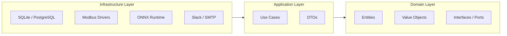

# Elevator Predictive Maintenance — Phase 1 Implementation Plan

> **Project:** AI Health Prediction & Camera Monitoring — Phase 1
> **Target:** Production-ready by end of August 2026
> **Classification:** Internal — Confidential
> **Last Reviewed:** 2026-05-29
> **Status:** In progress (implementation partially complete)

---

## Table of Contents

1. [Sensor Stack Summary](#0-sensor-stack-summary)
2. [Architecture Decisions](#1-architecture-decisions)
3. [Project Folder Structure — Clean Architecture](#2-project-folder-structure--clean-architecture)
4. [Backend Services](#3-backend-services)
5. [Database Schema](#4-database-schema)
6. [API Contract](#5-api-contract)
7. [Frontend Structure](#6-frontend-structure)
8. [Deployment & Configuration](#7-deployment--configuration)
9. [Implementation Checklist](#8-implementation-checklist)

---

> [!IMPORTANT]
> This plan contains both current implementation details and target-state architecture. Items marked as complete in Section 8 were reviewed against repository state on 2026-05-29; remaining items are still planned.

## 0. Sensor Stack Summary

All four sensors communicate via **RS-485 Modbus RTU** on a shared daisy-chain bus. Each sensor has a unique Slave ID and can be polled independently from a single edge device UART port via a USB→RS485 converter.

| Sensor | Type | Protocol | Poll Rate | Key Outputs | Baud | AI Usage |
|---|---|---|---|---|---|---|
| **ES-VS-01** | Vibration 3-axis | Modbus RTU | 1–10s | Accel RMS, Velocity RMS, Peak, Temp | 9600 | Anomaly detection, motor health trending |
| **ES35-SW** | Temp + Humidity (SHT35) | Modbus RTU | 10–30s | Temperature °C, Humidity %RH | 9600 | Environment monitoring, motor overheating |
| **RW-ST01D** | Loadcell converter (RS232→RS485) | Modbus RTU | 1–5s | Weight kg / N (from HD-MV01A) | 9600 | Cabin load monitoring, overload detection |
| **HD-MV01A** | Load cell (analog) | Analog → RW-ST01D | via converter | Raw strain gauge mV/V | — | Raw weight signal — processed by RW-ST01D |

> [!WARNING]
> **ES-VS-01 outputs pre-processed RMS values — NOT raw waveform.**
> FFT-based bearing fault detection is NOT possible with this sensor alone.
> You CAN do: trend monitoring, threshold alerting, time-series anomaly detection (LSTM/Isolation Forest), RUL estimation via degradation curves.
> **Poll interval recommendation:** 5s for vibration during operation, 30s for temperature/humidity.

---

## 1. Architecture Decisions

### 1.1 Deployment Model — Edge-First

All inference runs on an edge device co-located with the elevator controller panel. Cloud is used only for dashboarding, alerting, and long-term storage.

**Rationale:**
- Real-time alerting requirement < 3 seconds
- Elevator shafts often have poor network connectivity
- Data sovereignty — raw sensor data stays on-premises
- Hardware budget constraint — no cloud GPU needed

| Component | Chosen | Rejected | Reason |
|---|---|---|---|
| Edge hardware | **Orange Pi 4 Pro** | Jetson Nano, x86 mini-PC | RK3399 hexa-core, 4GB LPDDR4, USB 3.0, sufficient for ONNX CPU inference |
| OS | **Ubuntu 20.04 LTS** | RPi OS, Windows IoT | Stable, well-documented for ML workloads |
| Language | **Python 3.11** | Go, C++ | Fastest iteration, rich ML/sensor libraries |
| Serial driver | **minimalmodbus + pyserial** | pymodbus | Lightweight, simple, no broker needed |
| API framework | **FastAPI + uvicorn** | Flask, Django | Async-native, auto Swagger docs, Pydantic validation |
| ML runtime | **ONNX Runtime (CPU)** | TFLite, PyTorch | Framework-agnostic, fast CPU inference |
| DB (edge) | **SQLite via SQLAlchemy** | PostgreSQL, InfluxDB | Zero-config, embedded, sufficient for PoC |
| Cloud Comms| **MQTT (paho-mqtt)** | HTTP REST, Direct DB | Lightweight, QOS support, handles poor elevator shaft connectivity |
| DB (cloud) | **PostgreSQL (RDS/Supabase)** | MongoDB, TimescaleDB | Relational, good for structured sensor + event data |
| Dashboard | **Streamlit (PoC) → React (prod)** | Grafana, Tableau | Fast to build; React for production UX |
| Alerting | **Slack webhook + Email (SMTP)** | PagerDuty | Zero cost, sufficient for PoC |
| Containers | **Docker + docker-compose** | Kubernetes | Single-node deployment, simple to manage |
| CI/CD | **GitHub Actions** | Jenkins | Free tier, integrates with GitHub repo |

### 1.2 Data Flow Architecture

```mermaid
flowchart TD
    subgraph SENSORS["Sensor Layer"]
        VS["ES-VS-01<br/>Vibration"]
        TH["ES35-SW<br/>Temp/Humidity"]
        LC["RW-ST01D + HD-MV01A<br/>Load Cell"]
    end

    subgraph EDGE["Edge Device — Orange Pi 4 Pro"]
        SP["sensor_poller.py<br/>Modbus RTU"]
        RD["Redis Queue"]
        PP["preprocessor.py<br/>Rolling Features"]
        IE["inference_engine.py<br/>ONNX Runtime"]
        RE["rule_engine.py<br/>Threshold Rules"]
        DB["SQLite"]
        API["FastAPI Server"]
        AD["alert_dispatcher.py<br/>Slack / SMTP"]
        MQTT_PUB["mqtt_sync_job.py<br/>MQTT Client"]
    end

    subgraph CLOUD["Cloud"]
        BROKER["MQTT Broker<br/>(e.g., Mosquitto)"]
        SUB["Cloud Subscriber<br/>Worker"]
        PG["PostgreSQL"]
        DASH["React Dashboard"]
    end

    VS & TH & LC -->|RS-485 Bus| SP
    SP --> RD & DB
    RD --> PP --> IE --> RE
    RE --> AD & DB
    API --> DASH
    DB --> MQTT_PUB
    MQTT_PUB -->|Publish (QoS 1)| BROKER
    BROKER -->|Subscribe| SUB
    BROKER -->|Subscribe (Live)| DASH
    SUB -->|Insert| PG
```

### 1.3 ML Model Architecture

| Model | Input Features | Output | Algorithm | Trigger |
|---|---|---|---|---|
| Vibration Anomaly | accel_rms, velocity_rms, peak_accel (rolling 10min stats) | NORMAL / WARNING / CRITICAL | Isolation Forest → XGBoost | Every poll (5s) |
| Motor Health Score | vibration + temp + load (multivariate) | 0–100 health score | LSTM Autoencoder | Every 1 min |
| Overload Detection | load_kg vs max_capacity | SAFE / OVERLOAD | Rule-based threshold | Every poll (1s) |
| RUL Estimation | health_score trend (7-day window) | Hours to maintenance | Linear regression on degradation curve | Daily batch |

---

## 2. Project Folder Structure — Clean Architecture

The project follows **Clean Architecture** principles to ensure testability, maintainability, and clear separation of concerns. Dependencies point inward: Infrastructure → Application → Domain.



### 2.1 Full Directory Tree

```
elevator-pdm/
│
├── README.md
├── pyproject.toml                    # Project metadata, dependencies (PEP 621)
├── requirements.txt                  # Pinned production dependencies
├── requirements-dev.txt              # Test / lint / dev-only dependencies
├── Makefile                          # Common commands: make run, make test, make lint
├── docker-compose.yml                # Edge deployment orchestration
├── docker-compose.cloud.yml          # Cloud deployment override
├── .env.example                      # Template for environment variables
├── .github/
│   └── workflows/
│       ├── ci.yml                    # Lint + test on push/PR
│       └── deploy.yml                # Build & push Docker images
│
├── config/
│   ├── config.yaml                   # Edge device runtime config (Section 6.2)
│   ├── config.cloud.yaml             # Cloud-specific overrides
│   └── logging.yaml                  # Python logging configuration
│
├── docs/
│   ├── Elevator_PdM_Implementation_Plan.docx
│   ├── implementation_plan.md        # This document
│   ├── api_spec.yaml                 # OpenAPI 3.0 spec (auto-generated)
│   └── architecture.md               # ADRs and design decisions
│
├── src/
│   └── elevator_pdm/
│       ├── __init__.py
│       │
│       ├── domain/                   # ── DOMAIN LAYER (innermost) ──
│       │   ├── __init__.py
│       │   ├── entities/
│       │   │   ├── __init__.py
│       │   │   ├── elevator.py       # Elevator entity (id, name, location, capacity)
│       │   │   ├── sensor_reading.py  # SensorReading entity (immutable data point)
│       │   │   ├── inference_result.py # InferenceResult entity (status, score, confidence)
│       │   │   ├── alert.py           # Alert entity (type, severity, lifecycle)
│       │   │   └── maintenance.py     # MaintenanceSchedule entity (urgency, RUL)
│       │   ├── value_objects/
│       │   │   ├── __init__.py
│       │   │   ├── sensor_id.py       # SensorId enum (ES_VS_01, ES35_SW, RW_ST01D)
│       │   │   ├── health_score.py    # HealthScore (0-100, with color thresholds)
│       │   │   ├── alert_severity.py  # Severity enum (WARNING, CRITICAL, EMERGENCY)
│       │   │   └── status.py          # ElevatorStatus, InferenceStatus enums
│       │   ├── interfaces/            # Ports — abstract contracts (no implementation)
│       │   │   ├── __init__.py
│       │   │   ├── sensor_gateway.py   # ABC: read_vibration(), read_temp(), read_load()
│       │   │   ├── reading_repository.py  # ABC: save(), find_by_elevator(), find_latest()
│       │   │   ├── inference_repository.py
│       │   │   ├── alert_repository.py
│       │   │   ├── maintenance_repository.py
│       │   │   ├── elevator_repository.py
│       │   │   ├── notification_service.py # ABC: send_alert(alert) → bool
│       │   │   ├── model_runtime.py    # ABC: predict(features) → InferenceResult
│       │   │   └── event_bus.py        # ABC: publish(event), subscribe(handler)
│       │   ├── events/
│       │   │   ├── __init__.py
│       │   │   ├── reading_received.py # Domain event: new sensor data arrived
│       │   │   ├── anomaly_detected.py # Domain event: inference flagged anomaly
│       │   │   └── alert_raised.py     # Domain event: alert dispatched
│       │   └── exceptions.py          # Domain-specific exceptions
│       │
│       ├── application/              # ── APPLICATION LAYER (use cases) ──
│       │   ├── __init__.py
│       │   ├── use_cases/
│       │   │   ├── __init__.py
│       │   │   ├── poll_sensors.py     # Orchestrate: read sensor → store → enqueue
│       │   │   ├── process_reading.py  # Orchestrate: dequeue → compute features → infer
│       │   │   ├── run_inference.py    # Run ONNX model on feature vector
│       │   │   ├── evaluate_rules.py   # Apply threshold rules on inference output
│       │   │   ├── dispatch_alert.py   # Send alert with rate-limiting logic
│       │   │   ├── publish_to_mqtt.py  # Publish unsynced data via MQTT
│       │   │   ├── estimate_rul.py     # Daily RUL estimation batch job
│       │   │   ├── get_elevator_status.py  # Query current status for dashboard
│       │   │   ├── get_readings.py     # Paginated readings query
│       │   │   ├── get_alerts.py       # Filtered alert query
│       │   │   ├── acknowledge_alert.py # Mark alert as reviewed
│       │   │   ├── manage_maintenance.py # CRUD for maintenance schedule
│       │   │   └── reload_models.py    # Hot-reload ONNX models
│       │   ├── dto/
│       │   │   ├── __init__.py
│       │   │   ├── sensor_reading_dto.py   # Input/output data transfer objects
│       │   │   ├── inference_request_dto.py
│       │   │   ├── inference_response_dto.py
│       │   │   ├── alert_dto.py
│       │   │   ├── elevator_summary_dto.py
│       │   │   └── maintenance_dto.py
│       │   ├── services/
│       │   │   ├── __init__.py
│       │   │   ├── feature_engineer.py # Compute rolling features (Section 2.3)
│       │   │   └── health_calculator.py # Weighted combo → 0-100 health score
│       │   └── exceptions.py          # Application-level exceptions
│       │
│       ├── infrastructure/           # ── INFRASTRUCTURE LAYER (adapters) ──
│       │   ├── __init__.py
│       │   ├── sensors/
│       │   │   ├── __init__.py
│       │   │   ├── modbus_gateway.py   # Implements SensorGateway via minimalmodbus
│       │   │   └── mock_gateway.py     # Fake sensor data for testing/dev
│       │   ├── persistence/
│       │   │   ├── __init__.py
│       │   │   ├── database.py         # SQLAlchemy engine/session factory
│       │   │   ├── models.py           # SQLAlchemy ORM models (tables from Section 3)
│       │   │   ├── sqlite_reading_repo.py   # Implements ReadingRepository
│       │   │   ├── sqlite_inference_repo.py
│       │   │   ├── sqlite_alert_repo.py
│       │   │   ├── sqlite_maintenance_repo.py
│       │   │   ├── sqlite_elevator_repo.py
│       │   │   ├── postgres_reading_repo.py  # Cloud variant
│       │   │   └── migrations/
│       │   │       ├── alembic.ini
│       │   │       └── versions/       # Schema migration scripts
│       │   ├── ml/
│       │   │   ├── __init__.py
│       │   │   ├── onnx_runtime.py     # Implements ModelRuntime via onnxruntime
│       │   │   └── model_registry.py   # Version tracking, hot-reload logic
│       │   ├── messaging/
│       │   │   ├── __init__.py
│       │   │   ├── redis_event_bus.py  # Implements EventBus via Redis pub/sub
│       │   │   ├── redis_queue.py      # Redis list-based work queue
│       │   │   └── mqtt_publisher.py   # MQTT client implementation
│       │   ├── notifications/
│       │   │   ├── __init__.py
│       │   │   ├── slack_notifier.py   # Implements NotificationService (webhook)
│       │   │   ├── email_notifier.py   # Implements NotificationService (SMTP)
│       │   │   └── composite_notifier.py # Fan-out to multiple channels
│       │   ├── cloud/
│       │   │   ├── __init__.py
│       │   │   └── mqtt_sync_job.py    # Background job polling DB and publishing via MQTT
│       │   └── config/
│       │       ├── __init__.py
│       │       └── settings.py         # Pydantic BaseSettings — load from env/yaml
│       │
│       └── presentation/             # ── PRESENTATION LAYER (API + UI) ──
│           ├── __init__.py
│           ├── api/
│           │   ├── __init__.py
│           │   ├── main.py             # FastAPI app factory, lifespan, CORS
│           │   ├── dependencies.py     # Dependency injection (repos, services)
│           │   ├── auth.py             # API key / JWT auth middleware
│           │   ├── routers/
│           │   │   ├── __init__.py
│           │   │   ├── elevators.py    # GET /api/elevators, GET /{id}/readings
│           │   │   ├── predict.py      # POST /api/predict
│           │   │   ├── alerts.py       # GET /api/alerts, PATCH /{id}/acknowledge
│           │   │   ├── maintenance.py  # CRUD /api/maintenance
│           │   │   ├── models.py       # POST /api/models/reload
│           │   │   └── health.py       # GET /api/health
│           │   ├── websocket/
│           │   │   ├── __init__.py
│           │   │   └── sensor_stream.py # WS /ws/sensors/{elevator_id}
│           │   └── schemas/
│           │       ├── __init__.py
│           │       ├── requests.py      # Pydantic request models
│           │       └── responses.py     # Pydantic response models
│           └── dashboard/
│               ├── app.py              # Streamlit entry point
│               └── pages/
│                   ├── 1_fleet.py
│                   ├── 2_live.py
│                   ├── 3_alerts.py
│                   ├── 4_maintenance.py
│                   ├── 5_models.py
│                   └── 6_admin.py
│
├── models/                            # Trained ONNX model artifacts
│   ├── vibration_anomaly_v1.onnx
│   ├── health_score_v1.onnx
│   └── README.md                      # Model card: version, metrics, training date
│
├── notebooks/                         # Jupyter notebooks for exploration
│   ├── 01_data_exploration.ipynb
│   ├── 02_feature_engineering.ipynb
│   ├── 03_isolation_forest.ipynb
│   ├── 04_xgboost_classifier.ipynb
│   ├── 05_lstm_autoencoder.ipynb
│   └── 06_rul_estimation.ipynb
│
├── scripts/                           # Operational scripts
│   ├── seed_db.py                     # Insert sample elevator + readings
│   ├── export_onnx.py                 # Convert trained model → ONNX
│   ├── simulate_sensors.py            # Generate fake sensor stream for dev
│   └── benchmark_inference.py         # Measure ONNX inference latency
│
├── tests/
│   ├── conftest.py                    # Shared fixtures (in-memory DB, mock sensors)
│   ├── unit/
│   │   ├── domain/
│   │   │   ├── test_elevator.py
│   │   │   ├── test_sensor_reading.py
│   │   │   └── test_health_score.py
│   │   ├── application/
│   │   │   ├── test_feature_engineer.py
│   │   │   ├── test_poll_sensors.py
│   │   │   ├── test_run_inference.py
│   │   │   └── test_evaluate_rules.py
│   │   └── infrastructure/
│   │       ├── test_modbus_gateway.py
│   │       └── test_onnx_runtime.py
│   ├── integration/
│   │   ├── test_sensor_to_db.py       # Poller → SQLite round-trip
│   │   ├── test_inference_pipeline.py # Feature eng → ONNX → result
│   │   └── test_api_endpoints.py      # FastAPI TestClient
│   └── e2e/
│       └── test_full_pipeline.py      # Sensor → Inference → Alert → Dashboard
│
├── data/                              # Runtime data (gitignored)
│   ├── elevator.db                    # SQLite database
│   └── logs/                          # Application log files
│
└── deploy/                            # Deployment artifacts
    ├── Dockerfile.poller
    ├── Dockerfile.inference
    ├── Dockerfile.api
    ├── Dockerfile.dashboard
    ├── nginx.conf                     # Reverse proxy for production
    └── systemd/
        └── elevator-pdm.service       # systemd unit for non-Docker deploy
```

### 2.2 Layer Responsibilities & Rules

| Layer | Directory | Depends On | Responsibility |
|---|---|---|---|
| **Domain** | `src/elevator_pdm/domain/` | Nothing (no imports from other layers) | Entities, value objects, interfaces (ports), domain events, business rules |
| **Application** | `src/elevator_pdm/application/` | Domain only | Use cases (orchestration), DTOs, feature engineering, health scoring |
| **Infrastructure** | `src/elevator_pdm/infrastructure/` | Application + Domain | Adapters: Modbus, SQLite/PostgreSQL, Redis, ONNX, Slack, SMTP |
| **Presentation** | `src/elevator_pdm/presentation/` | Application + Domain | FastAPI routers, WebSocket, Pydantic schemas, Streamlit pages |

> [!IMPORTANT]
> **Dependency Rule:** Inner layers NEVER import from outer layers. Domain defines interfaces (ports); Infrastructure provides implementations (adapters). Use cases in Application depend only on abstractions from Domain.

### 2.3 Key Design Patterns

| Pattern | Where | Purpose |
|---|---|---|
| **Repository** | `domain/interfaces/*_repository.py` → `infrastructure/persistence/*_repo.py` | Abstract DB access — swap SQLite ↔ PostgreSQL without changing use cases |
| **Gateway** | `domain/interfaces/sensor_gateway.py` → `infrastructure/sensors/modbus_gateway.py` | Abstract sensor I/O — use mock gateway for tests |
| **Strategy** | `domain/interfaces/model_runtime.py` → `infrastructure/ml/onnx_runtime.py` | Swap inference engine (ONNX → TFLite) without touching business logic |
| **Observer** | `domain/events/*` → `infrastructure/messaging/redis_event_bus.py` | Decouple sensor polling from inference from alerting |
| **Composite** | `infrastructure/notifications/composite_notifier.py` | Fan-out alerts to Slack + Email via single interface |
| **Dependency Injection** | `presentation/api/dependencies.py` | FastAPI `Depends()` wires concrete implementations to abstract interfaces |

---

## 3. Backend Services

### 3.1 Service Map

| Service | File | Runs On | Responsibility |
|---|---|---|---|
| sensor polling orchestration | `src/elevator_pdm/application/use_cases/poll_sensors.py` | Edge (always on) | Poll all 3 Modbus sensors, write raw readings to SQLite + Redis queue |
| reading processor | `src/elevator_pdm/application/use_cases/process_reading.py` | Edge (always on) | Consume queue items and compute rolling features |
| inference engine | `src/elevator_pdm/application/use_cases/run_inference.py` | Edge (always on) | Run ONNX models and persist inference results |
| rule engine | `src/elevator_pdm/application/use_cases/evaluate_rules.py` | Edge (always on) | Apply threshold rules, classify severity |
| alert dispatcher | `src/elevator_pdm/application/use_cases/dispatch_alert.py` | Edge (always on) | Send Slack/SMTP alerts with rate limiting |
| api server | `src/elevator_pdm/presentation/api/main.py` | Edge + Cloud | REST + WebSocket endpoints |
| mqtt publisher | `src/elevator_pdm/infrastructure/messaging/mqtt_publisher.py` | Edge (background) | Publish data/events to MQTT broker |
| rul scheduler | `src/elevator_pdm/application/use_cases/estimate_rul.py` | Edge (scheduled) | Estimate RUL from health score trends |
| model training/export | `notebooks/*`, `scripts/export_onnx.py` | Offline / Cloud VM | Train models and export ONNX artifacts |

### 3.2 sensor_poller.py — Design Principles

- **Non-blocking:** each sensor polled in its own thread with individual try/except
- **Configurable** poll intervals per sensor type via `config.yaml`
- **Exponential backoff** on repeated Modbus read errors (max 60s)
- **Write raw readings to SQLite immediately** — never lose data even if downstream fails

> [!WARNING]
> Register addresses (0x00, 0x01...) are typical for these sensor classes. **Verify against the actual datasheet / register map** provided by EPCB for ES-VS-01 and RW-ST01D before deploying.

### 3.3 Feature Engineering — Preprocessor

| Feature | Formula | Window | Source | Purpose |
|---|---|---|---|---|
| accel_rms_mean | mean(accel_rms, W) | 10 min | ES-VS-01 | Baseline vibration level |
| accel_rms_std | std(accel_rms, W) | 10 min | ES-VS-01 | Stability / consistency |
| accel_delta | current − rolling_mean | 10 min | ES-VS-01 | Deviation from normal |
| accel_roc | (t − t−1) / interval | — | ES-VS-01 | Rate of change — sudden spikes |
| velocity_rms_z | (x − mean) / std | 1 hour | ES-VS-01 | Z-score: how many σ from normal |
| peak_to_rms_ratio | peak_accel / accel_rms | — | ES-VS-01 | Crest factor proxy — impulsive faults |
| motor_temp_delta | temp_vibsensor − temp_env | — | VS-01 & ES35-SW | Motor heat above ambient |
| humidity_trend | slope(humidity, W) | 30 min | ES35-SW | Rising humidity = moisture risk |
| load_pct | load_kg / max_capacity | — | RW-ST01D | Capacity utilization |
| load_variance | std(load_kg, W) | 5 min | RW-ST01D | Jerk / irregular loading |
| multivariate_score | concat all above | — | All | Input to LSTM Autoencoder |

---

## 4. Database Schema

SQLite on edge for real-time writes. PostgreSQL in cloud for long-term analytics. All tables use **UTC timestamps**.

### 4.1 Core Tables

#### `elevators`
| Column | Type | Constraints | Description |
|---|---|---|---|
| id | TEXT | PK | UUID v4 |
| name | TEXT | NOT NULL | e.g. 'Tower A - Lift 3' |
| location | TEXT | NOT NULL | Building / floor / shaft |
| max_capacity_kg | REAL | NOT NULL | Load cell max rated capacity |
| install_date | TEXT | NOT NULL | ISO date |
| last_maintenance | TEXT | | ISO datetime of last service |
| status | TEXT | DEFAULT 'active' | active \| decommissioned \| maintenance |
| created_at | TEXT | NOT NULL | UTC ISO timestamp |

#### `sensor_readings`
| Column | Type | Constraints | Description |
|---|---|---|---|
| id | INTEGER | PK AUTOINCREMENT | Row ID |
| elevator_id | TEXT | FK → elevators.id | Which elevator |
| sensor_id | TEXT | NOT NULL | ES-VS-01 \| ES35-SW \| RW-ST01D |
| timestamp | TEXT | NOT NULL, INDEX | UTC ISO datetime |
| accel_rms_mg | REAL | | ES-VS-01: acceleration RMS in mg |
| velocity_rms_mms | REAL | | ES-VS-01: velocity RMS in mm/s |
| peak_accel_mg | REAL | | ES-VS-01: peak acceleration |
| vib_temperature_c | REAL | | ES-VS-01: onboard temperature |
| env_temperature_c | REAL | | ES35-SW: ambient temperature |
| env_humidity_pct | REAL | | ES35-SW: relative humidity %RH |
| load_kg | REAL | | RW-ST01D: cabin load in kg |
| synced | INTEGER | DEFAULT 0 | 0=local, 1=synced to cloud |

#### `inference_results`
| Column | Type | Constraints | Description |
|---|---|---|---|
| id | INTEGER | PK AUTOINCREMENT | |
| elevator_id | TEXT | FK → elevators | |
| timestamp | TEXT | NOT NULL, INDEX | Time of inference |
| model_name | TEXT | NOT NULL | vibration_anomaly \| health_score \| overload |
| model_version | TEXT | NOT NULL | e.g. '1.2.0' |
| status | TEXT | NOT NULL | NORMAL \| WARNING \| CRITICAL \| OVERLOAD |
| confidence | REAL | | 0.0–1.0 |
| health_score | REAL | | 0–100 composite |
| features_json | TEXT | | JSON snapshot for audit/retraining |
| synced | INTEGER | DEFAULT 0 | |

#### `alerts`
| Column | Type | Constraints | Description |
|---|---|---|---|
| id | INTEGER | PK AUTOINCREMENT | |
| elevator_id | TEXT | FK | |
| inference_id | INTEGER | FK → inference_results | Triggering inference |
| alert_type | TEXT | NOT NULL | VIBRATION_HIGH \| TEMP_HIGH \| OVERLOAD \| HEALTH_LOW |
| severity | TEXT | NOT NULL | WARNING \| CRITICAL \| EMERGENCY |
| message | TEXT | NOT NULL | Human-readable |
| sent_at | TEXT | NOT NULL | UTC ISO datetime |
| channel | TEXT | NOT NULL | slack \| email \| sms |
| acknowledged | INTEGER | DEFAULT 0 | 1 when reviewed |
| acknowledged_by | TEXT | | Technician name |
| acknowledged_at | TEXT | | UTC timestamp |

#### `maintenance_schedule`
| Column | Type | Constraints | Description |
|---|---|---|---|
| id | INTEGER | PK AUTOINCREMENT | |
| elevator_id | TEXT | FK | |
| recommended_date | TEXT | NOT NULL | AI-recommended service date |
| urgency | TEXT | NOT NULL | routine \| soon (7d) \| urgent (24h) \| immediate |
| reason | TEXT | NOT NULL | e.g. 'Vibration anomaly sustained 48h' |
| estimated_rul_hours | REAL | | Remaining Useful Life |
| status | TEXT | DEFAULT 'pending' | pending \| scheduled \| completed \| cancelled |
| completed_at | TEXT | | Actual completion datetime |
| technician | TEXT | | Assigned technician |
| created_at | TEXT | NOT NULL | When AI generated this |

---

## 5. API Contract

All endpoints served by FastAPI on port **8000**. Swagger at `GET /docs`. All responses JSON. All timestamps ISO 8601 UTC.

> [!NOTE]
> **Auth:** PoC uses HTTP Basic / API key header (`X-API-Key`). Production: JWT Bearer with roles (`admin | technician | viewer`).

### 5.1 Sensor Data Endpoints

| Method | Endpoint | Auth | Description |
|---|---|---|---|
| GET | `/api/elevators` | viewer | List all elevators with status |
| GET | `/api/elevators/{id}/readings` | viewer | Paginated raw readings (`?from, to, sensor_id, limit`) |
| POST | `/api/predict` | tech | Manual inference trigger |

### 5.2 Alert & Maintenance Endpoints

| Method | Endpoint | Auth | Description |
|---|---|---|---|
| GET | `/api/alerts` | viewer | Paginated alert history |
| PATCH | `/api/alerts/{id}/acknowledge` | tech | Mark alert as reviewed |
| GET | `/api/maintenance` | viewer | Maintenance schedule list |
| POST | `/api/maintenance` | admin | Create manual maintenance entry |
| PATCH | `/api/maintenance/{id}` | tech | Update maintenance status |
| GET | `/api/elevators/{id}/health-history` | viewer | Health score time series |
| POST | `/api/models/reload` | admin | Hot-reload ONNX models |
| GET | `/api/health` | viewer | System health check |

### 5.3 WebSocket — Live Sensor Stream

**`WS ws://edge-device:8000/ws/sensors/{elevator_id}`**

Pushes JSON every 5s with latest readings + inference result.

### 5.4 Error Responses

| HTTP | Code | When |
|---|---|---|
| 400 | VALIDATION_ERROR | Pydantic schema validation failure |
| 401 | UNAUTHORIZED | Missing/invalid API key or JWT |
| 403 | FORBIDDEN | Insufficient role |
| 404 | ELEVATOR_NOT_FOUND | elevator_id does not exist |
| 422 | SENSOR_DATA_INVALID | Readings outside physical range |
| 503 | SENSOR_UNAVAILABLE | Modbus timeout |
| 503 | MODEL_NOT_LOADED | ONNX model missing or corrupt |

---

## 6. Frontend Structure

### 6.1 Streamlit App (PoC)

| Page | File | Content |
|---|---|---|
| Fleet Overview | `src/elevator_pdm/presentation/dashboard/pages/fleet.py` | Elevator list, status badges, health indicators |
| Live Monitor | `src/elevator_pdm/presentation/dashboard/pages/live.py` | Real-time charts (accel, load, temp), 5s refresh |
| Alerts & Maintenance | `src/elevator_pdm/presentation/dashboard/pages/alerts.py` | Alert list and maintenance actions in one page |

> [!NOTE]
> Planned split pages (`maintenance.py`, `models.py`, `admin.py`) are not yet implemented in the current repository.

---

## 7. Deployment & Configuration

### 7.1 Deployment Status (Current vs Planned)

- **Current repo state (2026-05-29):** No committed `docker-compose.yml` yet; `deploy/systemd/` exists as the deployment placeholder.
- **Planned:** Add edge `docker-compose.yml` after service entrypoints are finalized and MQTT cloud sync worker is implemented.

| Deployment Artifact | Status | Notes |
|---|---|---|
| `docker-compose.yml` (edge) | Planned | Not committed in this repository yet |
| Dockerfiles per service | Planned | Referenced in architecture, not yet committed |
| `deploy/systemd/` unit(s) | Placeholder | Directory exists; unit files still to be added |

### 7.2 config.yaml

```yaml
serial:
  port: /dev/ttyUSB0
  baudrate: 9600
  timeout_s: 1.0

sensors:
  vibration:  { slave_id: 1, poll_interval_s: 5,  model: ES-VS-01 }
  temp_humid: { slave_id: 2, poll_interval_s: 30, model: ES35-SW  }
  load:       { slave_id: 3, poll_interval_s: 1,  model: RW-ST01D }

elevator:
  id: elev-001
  max_capacity_kg: 1000

mqtt:
  broker_url: ${MQTT_BROKER_URL}
  port: ${MQTT_PORT}
  username: ${MQTT_USERNAME}
  password: ${MQTT_PASSWORD}
  topic_r: ${MQTT_TOPIC_R}
  topic_w: ${MQTT_TOPIC_W}
  client_id: ${MQTT_CLIENT_ID}
  qos: 1

thresholds:
  accel_rms_warning_mg:  80
  accel_rms_critical_mg: 150
  load_overload_pct:     0.95
  motor_temp_warning_c:  65
  motor_temp_critical_c: 80

models:
  vibration_anomaly: models/vibration_anomaly_v1.onnx
  health_score:      models/health_score_v1.onnx

alerts:
  rate_limit_minutes: 15
  slack_webhook: ${SLACK_WEBHOOK}
  smtp_host: ${SMTP_HOST}
  smtp_port: 587
  smtp_from: alerts@your-company.com
  smtp_to: [tech@your-company.com]
```

---

## 8. Implementation Checklist

### Phase 1A — Hardware & Connectivity (Week 1–2)

- [x] Obtain RS-485 to USB adapter (isolated, e.g. EPCB USB-TO-RS485-ISOLATED)
- [x] Assign unique Modbus Slave IDs: VS-01=1, ES35-SW=2, RW-ST01D=3
- [x] Wire sensors on shared RS-485 bus: A/B differential pair + GND
- [x] Enable 120Ω termination resistor on ES35-SW (built-in switch)
- [x] Test each sensor with Insight Sensor software (Windows) to verify register map
- [x] Document actual register addresses from ES-VS-01 and RW-ST01D datasheets
- [x] Verify HD-MV01A loadcell is calibrated and connected to RW-ST01D
- [x] Confirm Orange Pi 4 Pro can read all 3 sensors via minimalmodbus

### Phase 1B — Data Pipeline (Week 2–4)

- [x] Implement polling orchestration (`poll_sensors`) with per-sensor threading and exponential backoff
- [x] Create SQLite schema (Section 4) with indexes on `(elevator_id, timestamp)`
- [x] Collect 48h of baseline data — elevator running normally
- [x] Implement reading processing + rolling feature pipeline (`process_reading`, Section 3.3)
- [x] Validate feature distributions (no NaN, no extreme outliers)
- [x] Set up Redis as inter-process queue between poller and inference engine

### Phase 1C — ML Models (Week 4–8)

- [ ] Train Isolation Forest on 48h baseline vibration features → export ONNX
- [ ] Label first anomaly events manually: inject load spike, simulate high vibration
- [ ] Train XGBoost classifier on labeled data (NORMAL / WARNING / CRITICAL)
- [ ] Train LSTM Autoencoder on multivariate sensor sequence (10-min windows)
- [x] Implement `health_score` = weighted combo of anomaly confidence + trend
- [x] Implement rule-based overload detection (load_kg > 95% capacity)
- [x] Implement RUL estimation via linear regression on 7-day health_score trend
- [ ] Export all models to ONNX, benchmark inference time on edge device

### Phase 1D — API & Dashboard (Week 8–12)

- [x] Implement FastAPI server with all endpoints (Section 5)
- [x] Implement WebSocket `/ws/sensors/{elevator_id}` with 5s push cadence
- [x] Implement `alert_dispatcher` with Slack + SMTP + rate limiting
- [x] Build Streamlit dashboard: Fleet Overview, Live Monitor, Alerts & Maintenance
- [ ] Deploy all services via docker-compose on edge device
- [ ] Set up Cloud MQTT Broker (e.g. EMQX, Mosquitto) and configure edge credentials
- [ ] Implement edge cloud-sync job and cloud subscriber worker to insert into PostgreSQL
- [ ] End-to-end test: simulate anomaly → inference → alert → dashboard update
- [ ] Load test API: 10 concurrent clients, verify < 300ms p95 latency

---

> **Source:** [Elevator_PdM_Implementation_Plan.docx](./Elevator_PdM_Implementation_Plan.docx)
